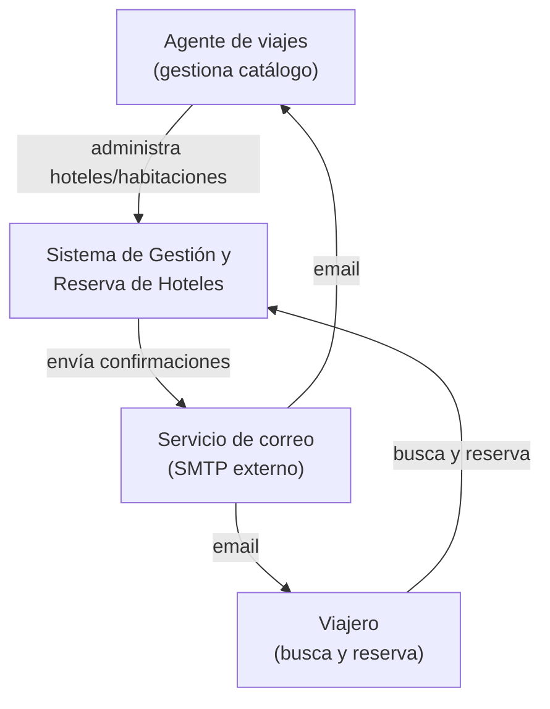
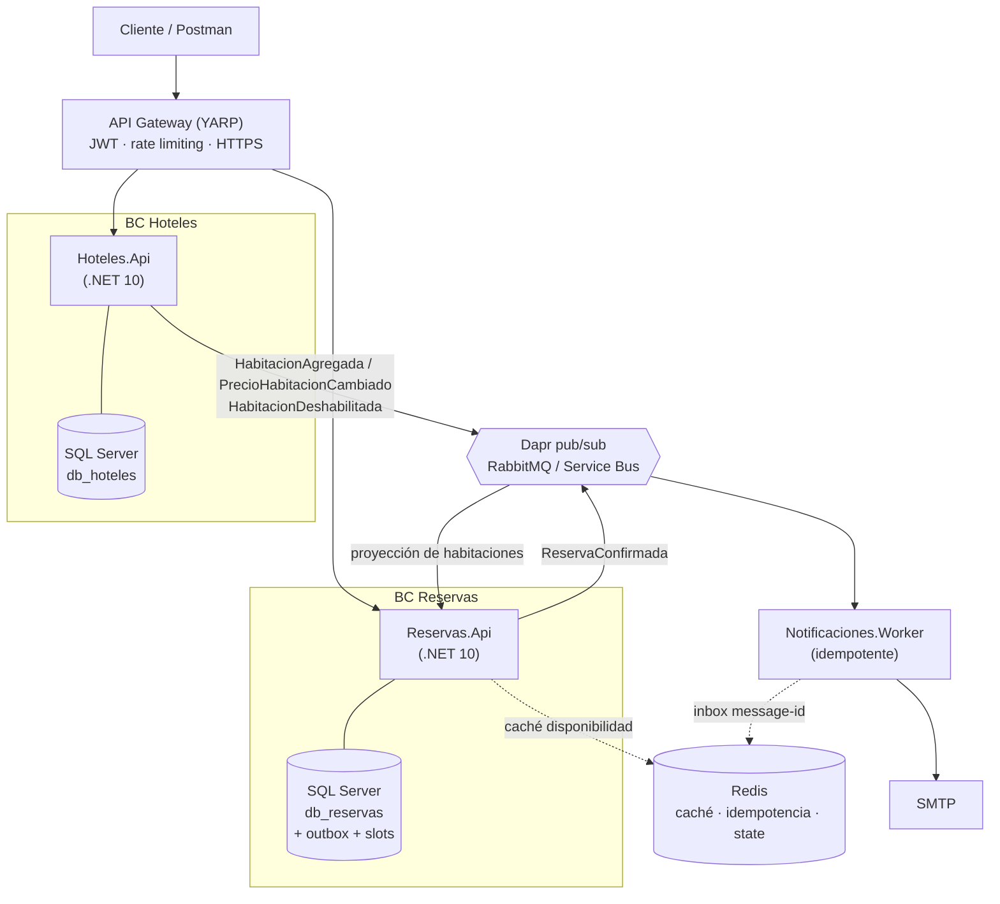

<div align="center">

# 🏨 hotel-booking-hub

**Sistema de gestión y reserva de hoteles** — back end distribuido, orientado a eventos, para una agencia de viajes.

Prueba técnica · Back End Developer · **UltraGroup** (Tech, Travel & Loyalty)


</div>

---

> **Estado del proyecto:** 🚧 planificación completa, implementación por comenzar. El contrato (SPEC), el PRD, la **arquitectura** (con ADRs y readiness) y el **backlog** (8 épicas / 31 historias con criterios de aceptación) están consolidados y trazados — ver [Mapa de documentación](#mapa-de-documentación). La primera historia (esqueleto ejecutable) está lista para desarrollo; las secciones de ejecución marcadas con 🚧 se habilitarán conforme avance el código.

## Tabla de contenido

- [Contexto](#contexto)
- [Decisiones y por qué](#decisiones-y-por-qué)
- [Mapa de documentación](#mapa-de-documentación)
- [Capacidades](#capacidades)
- [Arquitectura](#arquitectura)
- [Stack tecnológico](#stack-tecnológico)
- [El problema central: overbooking](#el-problema-central-overbooking)
- [Estructura del repositorio](#estructura-del-repositorio)
- [Puesta en marcha](#puesta-en-marcha)
- [Seguridad](#seguridad)
- [Pruebas](#pruebas)
- [Observabilidad](#observabilidad)
- [Despliegue en la nube](#despliegue-en-la-nube)
- [Convenciones](#convenciones)
- [Uso de IA en el desarrollo](#uso-de-ia-en-el-desarrollo)
- [Autor](#autor)

## Contexto

Una agencia de viajes gestiona hoteles y reservas de forma manual, lo que genera inconsistencias, pérdida de comisiones y mala experiencia. Este proyecto implementa el **back end** que resuelve el problema de forma **robusta, escalable y mantenible**, con dos capacidades principales: administración del catálogo (rol **Agente**) y búsqueda/reserva de habitaciones (rol **Viajero**), con notificación por correo al confirmar.

## Decisiones y por qué

Las decisiones que más pesan y el trade-off detrás de cada una (el detalle está en cada ADR):

| Decisión | Por qué (trade-off) | ADR |
|----------|---------------------|-----|
| Anti-overbooking por índice `UNIQUE(HabitacionId, Noche)` + **READ COMMITTED** (no `SERIALIZABLE`) | El índice arbitra el conflicto en el propio INSERT; `SERIALIZABLE` añadía deadlocks bajo contención que degradan el p95/p99 de la búsqueda (G7) sin beneficio. | [ADR-016](docs/specs/spec-hotel-booking-hub/decisions-adr.md) |
| Identidad **UUID v7 no-clustered** + *clustering key* `Seq bigint` interna | Identidad global estable en API/eventos sin fragmentar el índice clustered que produce `Guid.CreateVersion7()` bajo inserción concurrente. | [ADR-017](docs/specs/spec-hotel-booking-hub/decisions-adr.md) |
| **Outbox manual** at-least-once + idempotencia en el consumidor | No hay exactly-once en el wire; la no-duplicación se garantiza en el *efecto* (dedupe por message-id en Redis), no en el transporte. Se evita acoplar la persistencia al state store de Dapr. | [ADR-004](docs/specs/spec-hotel-booking-hub/decisions-adr.md) · [ADR-018](docs/specs/spec-hotel-booking-hub/decisions-adr.md) |
| **2 Bounded Contexts** que solo hablan por eventos (Dapr pub/sub) | Límites de dominio claros y escala independiente; se acepta consistencia eventual entre servicios (mitigada con outbox + proyecciones) a cambio de cero acoplamiento síncrono. | [ADR-001](docs/specs/spec-hotel-booking-hub/decisions-adr.md) · [ADR-002](docs/specs/spec-hotel-booking-hub/decisions-adr.md) |
| **Mediator propio** (no MediatR) | MediatR pasó a licencia comercial; un mediator de ~30 líneas con pipeline de *behaviors* mantiene el repo público limpio y demuestra dominio del patrón. | [ADR-005](docs/specs/spec-hotel-booking-hub/decisions-adr.md) · [ADR-018](docs/specs/spec-hotel-booking-hub/decisions-adr.md) |
| **SQL Server + Redis**; read model en MongoDB **diseñado, no implementado** | Redis cubre el caché de lectura a la escala objetivo (~10k reservas/día); introducir Mongo sería una BD más que asegurar/sincronizar sin necesidad hoy. | [ADR-003](docs/specs/spec-hotel-booking-hub/decisions-adr.md) · [ADR-013](docs/specs/spec-hotel-booking-hub/decisions-adr.md) |
| **`docker-compose` a mano** (no generado desde Aspire) + smoke test en CI | El evaluador ejecuta sin SDK ni Aspire; el compose manual se blinda contra *drift* con un smoke test de `/health`. | [ADR-007](docs/specs/spec-hotel-booking-hub/decisions-adr.md) |
| **Sin `aspire-starter`** (AppHost + ServiceDefaults a medida) | Se adopta solo lo transversal (orquestación + telemetría); se rechaza el *sample* que ensuciaría el repo con código muerto. | [ADR-015](docs/specs/spec-hotel-booking-hub/decisions-adr.md) |

## Mapa de documentación

Si buscas… → ve a:

| Quieres saber… | Documento |
|----------------|-----------|
| El **contrato canónico** (qué se construye, capacidades, invariantes) | [docs/specs/spec-hotel-booking-hub/SPEC.md](docs/specs/spec-hotel-booking-hub/SPEC.md) + companions |
| El **producto y los requisitos** (FR/NFR, journeys, fases) | [docs/planning-artifacts/prds/…/prd.md](docs/planning-artifacts/prds/prd-hotel-booking-hub-2026-07-08/prd.md) |
| Las **decisiones de arquitectura y su porqué** (diseño, spikes, readiness) | [docs/planning-artifacts/architecture.md](docs/planning-artifacts/architecture.md) |
| Los **ADRs** (contexto · decisión · consecuencias) | [docs/specs/spec-hotel-booking-hub/decisions-adr.md](docs/specs/spec-hotel-booking-hub/decisions-adr.md) |
| El **backlog** (8 épicas + 31 historias con AC) | [docs/planning-artifacts/epics.md](docs/planning-artifacts/epics.md) |
| El **documento fundacional** (razonamiento narrativo original) | [docs/DOCUMENTO-BASE.md](docs/DOCUMENTO-BASE.md) |
| El **estado del sprint** | [docs/implementation-artifacts/sprint-status.yaml](docs/implementation-artifacts/sprint-status.yaml) |

## Capacidades

| Historia | Descripción |
|----------|-------------|
| **HU1 · Administración de hoteles** | CRUD de hoteles y habitaciones (con borrado lógico), habilitar/deshabilitar, y listado de reservas del agente. |
| **HU2 · Reserva de habitaciones** | Búsqueda por ciudad/fechas/huéspedes, proceso de reserva con datos de huésped y contacto de emergencia, y confirmación por correo a huésped y agente. |

## Arquitectura

Dos **microservicios** alineados a *Bounded Contexts* (DDD), un **API Gateway** y un **worker de notificaciones**, comunicados de forma **asíncrona por eventos**. Cada servicio sigue **Clean Architecture**.

### C4 — Contexto



### C4 — Contenedores



### Decisiones clave

- **Microservicios por Bounded Context** (Hoteles, Reservas) + Gateway YARP + worker de notificaciones.
- **CQRS** con mediator propio y pipeline de *behaviors* (Decorator).
- **Consistencia de eventos**: patrón **Transactional Outbox** + **idempotencia** (inbox en Redis) → no se pierden ni se duplican mensajes.
- **Persistencia** SQL Server por servicio; **Redis** para caché, idempotencia y *state*.
- **Dapr** para pub/sub y secretos → *cloud-agnostic* (RabbitMQ en local, Azure Service Bus en la nube, sin cambiar código).

> El detalle completo y los **ADRs** (incluidos ADR-015/016/017/018, añadidos al diseñar la arquitectura) están en [docs/specs/spec-hotel-booking-hub/decisions-adr.md](docs/specs/spec-hotel-booking-hub/decisions-adr.md) y [docs/planning-artifacts/architecture.md](docs/planning-artifacts/architecture.md). El razonamiento narrativo original, en [docs/DOCUMENTO-BASE.md](docs/DOCUMENTO-BASE.md).

## Stack tecnológico

| Capa | Tecnología |
|------|-----------|
| Lenguaje / framework | C# · .NET 10 (Minimal API) |
| Persistencia | SQL Server (una BD por servicio) · EF Core 10 |
| Caché / state / idempotencia | Redis |
| Mensajería / runtime | Dapr (pub/sub + secrets) · RabbitMQ (local) / Azure Service Bus (nube) |
| API Gateway | YARP |
| Documentación de API | OpenAPI + Scalar |
| Validación | FluentValidation |
| Orquestación (dev) | .NET Aspire |
| Reproducibilidad | Docker Compose |
| Observabilidad | OpenTelemetry (→ Aspire dashboard / Application Insights) |
| Pruebas | xUnit · Testcontainers.MsSql · Postman/Newman |
| IaC / nube | Terraform · Azure Container Apps |

## El problema central: overbooking

El invariante de negocio *"no puede haber dos reservas solapadas de la misma habitación"* se garantiza **a nivel del motor de base de datos**, no con lógica de aplicación (frágil ante concurrencia). Se usa el **patrón de slots de inventario**: una fila por noche reservada con clave única.

```sql
CREATE TABLE NochesHabitacion (
    HabitacionId UNIQUEIDENTIFIER NOT NULL,
    Noche        DATE             NOT NULL,
    ReservaId    UNIQUEIDENTIFIER NOT NULL,
    CONSTRAINT PK_NochesHabitacion PRIMARY KEY (HabitacionId, Noche)
);
```

Los slots `[entrada, salida)` se insertan en **una sola transacción bajo READ COMMITTED**: si alguna noche ya existe, la violación del índice `UNIQUE(HabitacionId, Noche)` (`SqlException` 2627/2601) arbitra el conflicto → **409 Conflict**, sin retry. Solo el deadlock (`1205`) se reintenta (acotado, backoff+jitter). Se descartó `SERIALIZABLE` por costo/contención ([ADR-016](docs/specs/spec-hotel-booking-hub/decisions-adr.md)). Dos reservas concurrentes sobre la misma habitación y fechas: una gana, la otra recibe 409. Cero overbooking, garantizado por el motor.

## Estructura del repositorio

```
hotel-booking-hub/
├── src/
│   ├── ApiGateway/                     # YARP (auth, rate limit, HTTPS)
│   ├── Servicios/
│   │   ├── Hoteles/{Api,Application,Domain,Infrastructure}
│   │   ├── Reservas/{Api,Application,Domain,Infrastructure}
│   │   └── Notificaciones/Notificaciones.Worker
│   ├── Comun/HotelBookingHub.Comun/    # shared kernel (Result, mediator, behaviors)
│   └── AppHost/                        # .NET Aspire
├── tests/                              # Unit + Integration (Testcontainers.MsSql)
├── deploy/{dapr,terraform}             # docker-compose · Dapr components · IaC Azure
├── docs/{DOCUMENTO-BASE.md, adr/}      # ingeniería, C4, ADRs
└── postman/                            # colección + entorno (Newman)
```

## Puesta en marcha

### Requisitos previos
- [.NET 10 SDK](https://dotnet.microsoft.com/) · [Docker Desktop](https://www.docker.com/) · [Dapr CLI](https://dapr.io/)
- **.NET Aspire 13** se resuelve **solo por NuGet** (vía `Aspire.AppHost.Sdk`); el antiguo `dotnet workload install aspire` está **deprecado y no se usa** ([ADR-015](docs/specs/spec-hotel-booking-hub/decisions-adr.md)). Para la Opción B (Docker Compose) no se necesita ni el SDK ni Aspire.

### 🚧 Opción A — Desarrollo con .NET Aspire *(disponible desde la Fase 1)*
```bash
dotnet run --project src/AppHost
```
Levanta todos los servicios + SQL Server + Redis + RabbitMQ + sidecars Dapr, con dashboard de OpenTelemetry.

### 🚧 Opción B — Reproducible con Docker Compose *(disponible desde la Fase 1)*
```bash
docker compose -f deploy/docker-compose.yml up
```
No requiere instalar el SDK ni el *workload* de Aspire. Incluye el dashboard de Aspire *standalone* para ver las trazas.

## Seguridad

Defensa en profundidad con 8 prácticas mapeadas a **OWASP Top 10 (2021)**: JWT/OIDC (A07), RBAC server-side (A01), rate limiting, validación anti-inyección (A03), secretos en Key Vault + Managed Identity (A02), HTTPS/HSTS (A05), logging de eventos de seguridad (A09) y protección de PII (A08/A10). Adicionalmente, *readiness* documentada para **PCI DSS** e **ISO 27001**. Detalle en [docs/DOCUMENTO-BASE.md §8.10 y §11](docs/DOCUMENTO-BASE.md).

### Autenticación JWT (Épica 6, Story 6.1)

Toda operación de negocio exige un **JWT Bearer** válido: el **Gateway** lo valida en el borde (401 si falta o es inválido) y cada servicio lo revalida (defensa en profundidad). Se verifican **issuer, audience, expiración y firma** (HMAC-SHA256).

- **Clave de firma — cero secretos en el repo.** La clave vive en `Jwt:SigningKey`, provista por entorno/`user-secrets`/Key Vault, **nunca** en `appsettings.json` (que solo lleva `Issuer`/`Audience`). Para Docker Compose, define `JWT_SIGNING_KEY` en `deploy/.env` (ver `deploy/.env.example`). Genera una con `openssl rand -base64 48`.
  ```bash
  # Local (por servicio): dotnet user-secrets set "Jwt:SigningKey" "<clave-256-bits>"
  # Compose:  echo "JWT_SIGNING_KEY=$(openssl rand -base64 48)" >> deploy/.env
  ```
- **Contrato del token.** `iss = hotel-booking-hub`, `aud = hotel-booking-hub-api`, y claims `sub`/`email` (identidad del agente) + `role` (`Agente` | `Viajero`). El `role` habilita el RBAC (6.2) y la identidad, el aislamiento entre agentes (6.3).
- **Obtener un token de dev para Postman/Newman.** Como el emisor es propio y la clave es simétrica compartida, un *pre-request script* de Postman lo firma en el sandbox (CryptoJS), sin secretos en la colección (la clave se lee de una variable de entorno de Postman). La lógica de emisión de referencia está en `tests/TestKit.Auth/TokenDePrueba.Emitir`.

### Autorización por rol — RBAC (Story 6.2)

El claim `role` (`Agente` | `Viajero`) se resuelve **server-side** en cada servicio con policies nativas de .NET. Un rol sin permiso recibe **403** (distinto del 401 de autenticación). Mapa rol→endpoint:

| Endpoint | Policy | Rol |
|----------|--------|-----|
| `POST /api/v1/hoteles`, y todo `hoteles/*` y `habitaciones/*` (gestión) | `SoloAgente` | **Agente** |
| `GET /api/v1/reservas`, `GET /api/v1/reservas/{id}` (listado/detalle del agente) | `SoloAgente` | **Agente** |
| `POST .../cancelacion/resolucion`, `.../cancelaciones/atajo`, `GET .../cancelaciones-pendientes` | `SoloAgente` | **Agente** |
| `GET /api/v1/habitaciones/disponibles` (búsqueda) | `AgenteOViajero` | Viajero **y** Agente |
| `POST /api/v1/reservas` (crear-confirmar) | `AgenteOViajero` | Viajero **y** Agente |
| `POST .../solicitud-cancelacion` (solicitar) | `AgenteOViajero` | Viajero **y** Agente |

Un test estructural en CI verifica que **ningún** endpoint de negocio quede sin policy (secure-by-default). El **aislamiento por datos** entre agentes (un agente no toca lo de otro) es la Story 6.3 — ortogonal al rol.

## Pruebas

- **TDD obligatorio** (Red → Green → Refactor) en el flujo crítico: *cálculo de precio* y *creación de reserva con anti-overbooking*.
- **Unit**: xUnit + EF Core InMemory. **Integración**: xUnit + **Testcontainers.MsSql** (SQL Server real).
- **API**: colección **Postman** ejecutada con **Newman** en CI.
- Objetivo de cobertura: **≥ 80 %** en código nuevo.

## Observabilidad

**OpenTelemetry** (trazas, métricas y logs) en todos los servicios. En local, dashboard de Aspire; en la nube, Application Insights. Instrumentado para detectar degradaciones de latencia (histogramas p95/p99, trazas distribuidas con *exemplars*).

## Despliegue en la nube

**Azure Container Apps** (Dapr gestionado + autoscale KEDA), **Azure SQL Database**, **Azure Cache for Redis**, **Azure Service Bus**, **Key Vault + Managed Identity** y **Application Insights**, todo provisionado con **Terraform**. Se aborda en la Fase 3.

## Convenciones

- **Idioma del código:** dominio en español sin tildes (`Habitacion`, `Reserva`, `Huesped`); sufijos de patrón en inglés por convención (`Command`, `Query`, `Repository`, `Handler`).
- **Ramas:** `main` (estable) · `develop` (integración) · `feature/*` (por historia).
- **Commits:** [Conventional Commits](https://www.conventionalcommits.org/) (`feat:`, `fix:`, `docs:`, `test:`, `refactor:`...).

## Uso de IA en el desarrollo

El proyecto se desarrolla con asistencia de IA (Claude Code) bajo el método **BMAD** (Analyst → PM → Architect → SM → Dev → QA). Todo el código generado se verifica contra reglas de calidad/seguridad, TDD y revisión humana. Los casos de generación asistida de módulos críticos se documentan con su *prompt* e iteración. Ver [docs/DOCUMENTO-BASE.md §16](docs/DOCUMENTO-BASE.md).

## Autor

**Santiago Renteria** · [github.com/SantiagoRenteria](https://github.com/SantiagoRenteria)

> Uso educativo / evaluación técnica.
