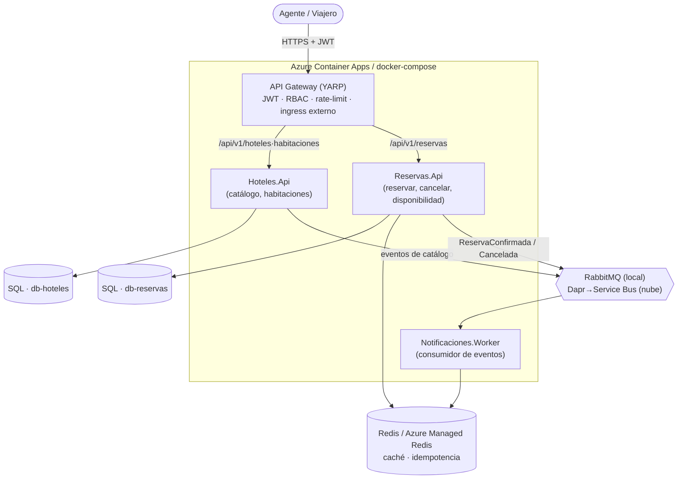

<div align="center">

# 🏨 hotel-booking-hub

**Sistema de gestión y reserva de hoteles** — back end distribuido, orientado a eventos, para una agencia de viajes.

Prueba técnica · Back End Developer · **UltraGroup** (Tech, Travel & Loyalty)


</div>

---

> **Este documento responde: qué es, cómo se ejecuta y por qué se decidió así.** Para el detalle de cada decisión → [`docs/adr/`](docs/adr/). Para el contrato/planificación → [Mapa de documentación](#dónde-está-x-mapa-de-documentación).

> **Estado:** implementado y verificado. Núcleo de dominio + mensajería (Épicas 1-6, 9), observabilidad (7) y nube por IaC (8) completos; despliegue **probado de verdad** en Azure (West US 2) con CD por OIDC. `docker compose up` levanta el sistema **funcional end-to-end en local** (un comando). Épica T (entrega) en curso.

## Decisiones y por qué

| # | Decisión | Trade-off / por qué | ADR |
|---|----------|---------------------|-----|
| 1 | **2 microservicios (Hoteles, Reservas) + Gateway + Worker** por Bounded Context | (+) escala/deploy independiente, límites claros · (−) consistencia eventual → mitigada con Outbox + proyecciones | [ADR-001](docs/adr/ADR-001-arquitectura-de-microservicios-por-bounded-context.md) |
| 2 | **Anti-overbooking por slots + índice único** (READ COMMITTED, no SERIALIZABLE) | el `UNIQUE(HabitacionId, Noche)` arbitra el conflicto en el INSERT sin bloquear de más | [ADR-003](docs/adr/ADR-003-sql-server-con-anti-overbooking-por-slots-de-inventario.md) · [ADR-016](docs/adr/ADR-016-arbitraje-del-invariante-por-ndice-nico-read-committed-en-ve.md) |
| 3 | **Transactional Outbox + idempotencia** | entrega at-least-once sin 2PC; el consumidor dedup por inbox | [ADR-004](docs/adr/ADR-004-transactional-outbox-idempotencia.md) |
| 4 | **CQRS con mediator propio** (sin MediatR) | control total del pipeline, sin licencia; contrato explícito | [ADR-005](docs/adr/ADR-005-cqrs-con-mediator-propio.md) · [ADR-018](docs/adr/ADR-018-contrato-del-mediator-propio-y-atomicidad-del-outbox.md) |
| 5 | **Transporte por Strategy según entorno** — RabbitMQ directo local / Dapr→Service Bus nube, tras `IPublicadorEventos` | el dominio no conoce el transporte; local corre end-to-end sin sidecars | [ADR-019](docs/adr/ADR-019-transporte-de-eventos-por-strategy-seg-n-entorno-rabbitmq-lo.md) |
| 6 | **Cero secretos en repo** — `random_password` + Key Vault + Managed Identity/OIDC | passwordless; verificado por gitleaks en CI; `.env` gitignored | [ADR-020](docs/adr/ADR-020-gesti-n-de-secretos-por-entorno-env-vars-local-dapr-secrets.md) · [ADR-022](docs/adr/ADR-022-state-remoto-de-terraform-por-bootstrap-az-backend-aad-dos-r.md) |
| 7 | **Nube por Terraform (ACA) + CD por OIDC**, ciclo apply→smoke→destroy de bajo costo | IaC reproducible, sin click-ops; gate humano = aprobación de PR en `main` | [ADR-008](docs/adr/ADR-008-azure-container-apps-terraform-con-criterio-de-migraci-n-a-a.md) · [ADR-021](docs/adr/ADR-021-cd-por-oidc-federated-despliegue-on-demand-con-aprobaci-n-ce.md) |

Registro completo (23 ADRs): [`docs/adr/`](docs/adr/README.md).

## Arquitectura (C4 · contenedores)



> El transporte es RabbitMQ directo en local (corre end-to-end, verificado) y **Dapr→Service Bus en nube** (adaptador `PublicadorEventosDapr` + suscripción Dapr del worker, seleccionados por entorno; verificación de runtime en el deploy de nube por el CD). Ver [ADR-019](docs/adr/ADR-019-transporte-de-eventos-por-strategy-seg-n-entorno-rabbitmq-lo.md).

## Ejecutar en local (un comando)

Requiere Docker. Copia `deploy/.env.example` → `deploy/.env` y define `MSSQL_SA_PASSWORD` y `JWT_SIGNING_KEY`.

```bash
docker compose -f deploy/docker-compose.yml up -d --build
# Gateway en http://localhost:8080  ·  /health anónimo
# Dashboard OTel: http://localhost:18888
```

Levanta Gateway + Hoteles + Reservas + Worker + SQL×2 + Redis + RabbitMQ + dashboard OTel; las migraciones EF se aplican al arranque (`AplicarMigraciones`). El flujo crear hotel→habitación→reserva→cancelar funciona end-to-end, con la notificación disparada por RabbitMQ. La colección [`postman/`](postman/) ejercita el flujo (auth JWT incluida).

## Nube (Azure) e IaC

Todo por Terraform (`deploy/terraform/`, ADR-008): ACA + Dapr/KEDA, Azure SQL×2, Azure Managed Redis, Service Bus, Key Vault, App Insights, ACR, Managed Identity. Despliegue **probado de verdad** en West US 2 (ciclo apply→smoke→destroy). CD automático por OIDC al merge a `main` (gate = aprobación de PR). Runbook y setup: [`deploy/terraform/README.md`](deploy/terraform/README.md).

## Árbol de carpetas

```
├─ src/
│  ├─ ApiGateway/          # YARP: JWT, RBAC, rate-limit, ruteo (único ingress externo)
│  ├─ Comun/               # librerías compartidas (mediator, Web/seguridad, resultados, mensajería)
│  ├─ AppHost/             # Aspire AppHost + ServiceDefaults (OTel, health, discovery)
│  └─ Servicios/
│     ├─ Hoteles/          # BC Hoteles (Domain · Application · Infrastructure · Api)
│     ├─ Reservas/         # BC Reservas (idem) — anti-overbooking, cancelación
│     └─ Notificaciones/   # Worker: consumidor de eventos → notificaciones
├─ tests/                  # unit · integración (Testcontainers) · funcionales · money test
├─ deploy/
│  ├─ docker-compose.yml   # stack local funcional (ADR-007)
│  ├─ terraform/           # IaC Azure + bootstrap del state + runbook (ADR-008)
│  ├─ scripts/             # deploy/destroy/build-push/migrate/smoke (reusados por el CD)
│  └─ dapr/                # componentes Dapr (referencia de nube)
├─ docs/
│  ├─ adr/                 # 23 ADRs como archivos (Contexto·Decisión·Consecuencias)
│  ├─ seguridad.md         # prácticas de seguridad → OWASP
│  ├─ uso-de-ia.md         # cómo se usó la IA (método BMAD, de punta a punta)
│  ├─ observabilidad.md    # trazas distribuidas + métricas + transporte de eventos
│  ├─ bdd-y-e2e.md         # flujos BDD + estrategia de pruebas E2E
│  ├─ specs/ · planning-artifacts/ · implementation-artifacts/   # SPEC, PRD, épicas, historias
│  └─ DOCUMENTO-BASE.md    # documento base consolidado
└─ .github/workflows/      # ci.yml (build·format·test·gitleaks·terraform) + cd.yml (OIDC)
```

## ¿Dónde está X? (mapa de documentación)

| Si quieres… | Ve a |
|---|---|
| Las **decisiones** y su porqué | [`docs/adr/`](docs/adr/README.md) |
| **Ejecutar** local | [arriba](#ejecutar-en-local-un-comando) · `deploy/docker-compose.yml` |
| **Desplegar** a Azure / CD | [`deploy/terraform/README.md`](deploy/terraform/README.md) |
| **Seguridad** (OWASP) | [`docs/seguridad.md`](docs/seguridad.md) |
| **Uso de IA** (método BMAD) | [`docs/uso-de-ia.md`](docs/uso-de-ia.md) |
| El **contrato** y requisitos | [`docs/specs/`](docs/specs/) · [`docs/DOCUMENTO-BASE.md`](docs/DOCUMENTO-BASE.md) |
| **Observabilidad** | [`docs/observabilidad.md`](docs/observabilidad.md) |
| **Pruebas** (BDD + E2E) | [`docs/bdd-y-e2e.md`](docs/bdd-y-e2e.md) |
| El **backlog** (31 historias, no es lectura de evaluación) | [`docs/planning-artifacts/epics.md`](docs/planning-artifacts/epics.md) |

## Stack

.NET 10 · C# · Clean Architecture + DDD + CQRS · SQL Server / Azure SQL · Redis / Azure Managed Redis · RabbitMQ (local) / Dapr→Service Bus (nube) · YARP · OpenTelemetry · EF Core · Terraform · Azure Container Apps · GitHub Actions.
