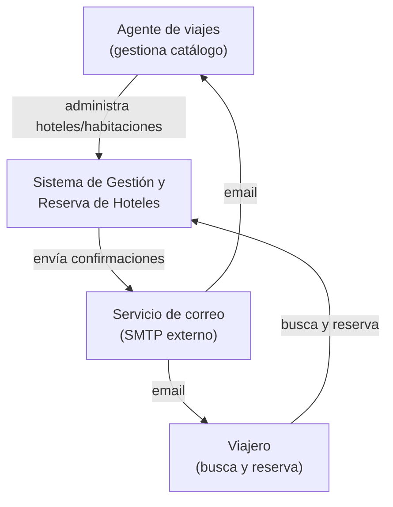
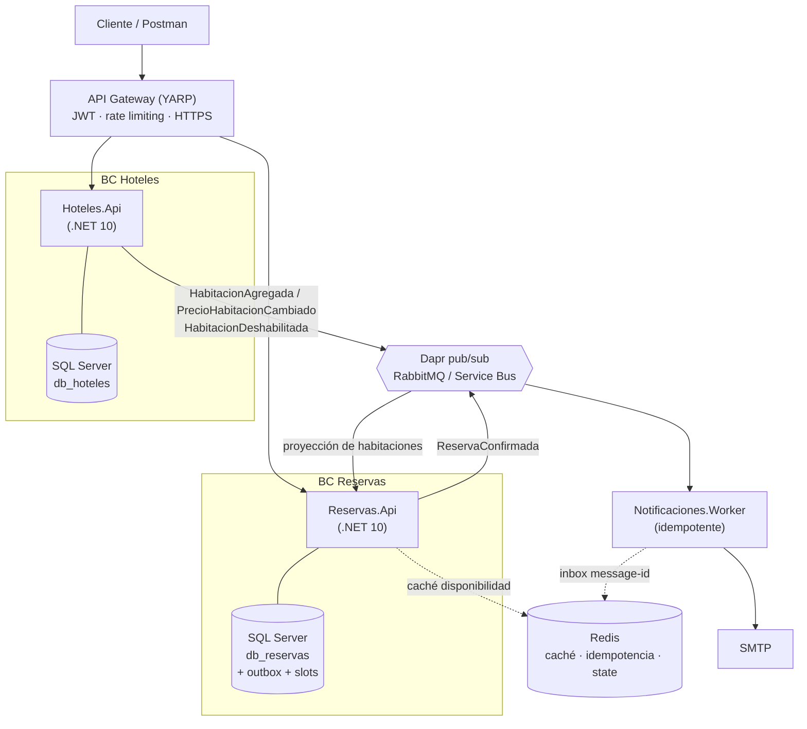

<div align="center">

# 🏨 hotel-booking-hub

**Sistema de gestión y reserva de hoteles** — back end distribuido, orientado a eventos, para una agencia de viajes.

Prueba técnica · Back End Developer · **UltraGroup** (Tech, Travel & Loyalty)


-orange)

</div>

---

> **Estado del proyecto:** 🚧 Fase 2 — *scaffold* del repositorio. La ingeniería (requisitos, arquitectura, ADRs y decisiones, detalle a detalle) está consolidada en **[docs/DOCUMENTO-BASE.md](docs/DOCUMENTO-BASE.md)**. La implementación de código llega en la Fase 1; las secciones de ejecución marcadas con 🚧 se habilitarán entonces.

## Tabla de contenido

- [Contexto](#contexto)
- [Capacidades](#capacidades)
- [Arquitectura](#arquitectura)
- [Stack tecnológico](#stack-tecnológico)
- [El problema central: overbooking](#el-problema-central-overbooking)
- [Estructura del repositorio](#estructura-del-repositorio)
- [Puesta en marcha](#puesta-en-marcha)
- [Seguridad](#seguridad)
- [Pruebas](#pruebas)
- [Observabilidad](#observabilidad)
- [Despliegue en la nube](#despliegue-en-la-nube)
- [Convenciones](#convenciones)
- [Uso de IA en el desarrollo](#uso-de-ia-en-el-desarrollo)
- [Autor](#autor)

## Contexto

Una agencia de viajes gestiona hoteles y reservas de forma manual, lo que genera inconsistencias, pérdida de comisiones y mala experiencia. Este proyecto implementa el **back end** que resuelve el problema de forma **robusta, escalable y mantenible**, con dos capacidades principales: administración del catálogo (rol **Agente**) y búsqueda/reserva de habitaciones (rol **Viajero**), con notificación por correo al confirmar.

## Capacidades

| Historia | Descripción |
|----------|-------------|
| **HU1 · Administración de hoteles** | CRUD de hoteles y habitaciones (con borrado lógico), habilitar/deshabilitar, y listado de reservas del agente. |
| **HU2 · Reserva de habitaciones** | Búsqueda por ciudad/fechas/huéspedes, proceso de reserva con datos de huésped y contacto de emergencia, y confirmación por correo a huésped y agente. |

## Arquitectura

Dos **microservicios** alineados a *Bounded Contexts* (DDD), un **API Gateway** y un **worker de notificaciones**, comunicados de forma **asíncrona por eventos**. Cada servicio sigue **Clean Architecture**.

### C4 — Contexto



### C4 — Contenedores



### Decisiones clave

- **Microservicios por Bounded Context** (Hoteles, Reservas) + Gateway YARP + worker de notificaciones.
- **CQRS** con mediator propio y pipeline de *behaviors* (Decorator).
- **Consistencia de eventos**: patrón **Transactional Outbox** + **idempotencia** (inbox en Redis) → no se pierden ni se duplican mensajes.
- **Persistencia** SQL Server por servicio; **Redis** para caché, idempotencia y *state*.
- **Dapr** para pub/sub y secretos → *cloud-agnostic* (RabbitMQ en local, Azure Service Bus en la nube, sin cambiar código).

> El detalle completo, los trade-offs y los **11 ADRs** están en [docs/DOCUMENTO-BASE.md](docs/DOCUMENTO-BASE.md).

## Stack tecnológico

| Capa | Tecnología |
|------|-----------|
| Lenguaje / framework | C# · .NET 10 (Minimal API) |
| Persistencia | SQL Server (una BD por servicio) · EF Core 10 |
| Caché / state / idempotencia | Redis |
| Mensajería / runtime | Dapr (pub/sub + secrets) · RabbitMQ (local) / Azure Service Bus (nube) |
| API Gateway | YARP |
| Documentación de API | OpenAPI + Scalar |
| Validación | FluentValidation |
| Orquestación (dev) | .NET Aspire |
| Reproducibilidad | Docker Compose |
| Observabilidad | OpenTelemetry (→ Aspire dashboard / Application Insights) |
| Pruebas | xUnit · Testcontainers.MsSql · Postman/Newman |
| IaC / nube | Terraform · Azure Container Apps |

## El problema central: overbooking

El invariante de negocio *"no puede haber dos reservas solapadas de la misma habitación"* se garantiza **a nivel del motor de base de datos**, no con lógica de aplicación (frágil ante concurrencia). Se usa el **patrón de slots de inventario**: una fila por noche reservada con clave única.

```sql
CREATE TABLE NochesHabitacion (
    HabitacionId UNIQUEIDENTIFIER NOT NULL,
    Noche        DATE             NOT NULL,
    ReservaId    UNIQUEIDENTIFIER NOT NULL,
    CONSTRAINT PK_NochesHabitacion PRIMARY KEY (HabitacionId, Noche)
);
```

Dos reservas concurrentes sobre la misma habitación y fechas: una gana, la otra recibe **409 Conflict**. Cero overbooking, garantizado por el motor y portable.

## Estructura del repositorio

```
hotel-booking-hub/
├── src/
│   ├── ApiGateway/                     # YARP (auth, rate limit, HTTPS)
│   ├── Servicios/
│   │   ├── Hoteles/{Api,Application,Domain,Infrastructure}
│   │   ├── Reservas/{Api,Application,Domain,Infrastructure}
│   │   └── Notificaciones/Notificaciones.Worker
│   ├── Comun/HotelBookingHub.Comun/    # shared kernel (Result, mediator, behaviors)
│   └── AppHost/                        # .NET Aspire
├── tests/                              # Unit + Integration (Testcontainers.MsSql)
├── deploy/{dapr,terraform}             # docker-compose · Dapr components · IaC Azure
├── docs/{DOCUMENTO-BASE.md, adr/}      # ingeniería, C4, ADRs
└── postman/                            # colección + entorno (Newman)
```

## Puesta en marcha

### Requisitos previos
- [.NET 10 SDK](https://dotnet.microsoft.com/) · [Docker Desktop](https://www.docker.com/) · [Dapr CLI](https://dapr.io/)
- (Opcional, para el dev-loop) *workload* de .NET Aspire: `dotnet workload install aspire`

### 🚧 Opción A — Desarrollo con .NET Aspire *(disponible desde la Fase 1)*
```bash
dotnet run --project src/AppHost
```
Levanta todos los servicios + SQL Server + Redis + RabbitMQ + sidecars Dapr, con dashboard de OpenTelemetry.

### 🚧 Opción B — Reproducible con Docker Compose *(disponible desde la Fase 1)*
```bash
docker compose -f deploy/docker-compose.yml up
```
No requiere instalar el SDK ni el *workload* de Aspire. Incluye el dashboard de Aspire *standalone* para ver las trazas.

## Seguridad

Defensa en profundidad con 8 prácticas mapeadas a **OWASP Top 10 (2021)**: JWT/OIDC (A07), RBAC server-side (A01), rate limiting, validación anti-inyección (A03), secretos en Key Vault + Managed Identity (A02), HTTPS/HSTS (A05), logging de eventos de seguridad (A09) y protección de PII (A08/A10). Adicionalmente, *readiness* documentada para **PCI DSS** e **ISO 27001**. Detalle en [docs/DOCUMENTO-BASE.md §8.10 y §11](docs/DOCUMENTO-BASE.md).

## Pruebas

- **TDD obligatorio** (Red → Green → Refactor) en el flujo crítico: *cálculo de precio* y *creación de reserva con anti-overbooking*.
- **Unit**: xUnit + EF Core InMemory. **Integración**: xUnit + **Testcontainers.MsSql** (SQL Server real).
- **API**: colección **Postman** ejecutada con **Newman** en CI.
- Objetivo de cobertura: **≥ 80 %** en código nuevo.

## Observabilidad

**OpenTelemetry** (trazas, métricas y logs) en todos los servicios. En local, dashboard de Aspire; en la nube, Application Insights. Instrumentado para detectar degradaciones de latencia (histogramas p95/p99, trazas distribuidas con *exemplars*).

## Despliegue en la nube

**Azure Container Apps** (Dapr gestionado + autoscale KEDA), **Azure SQL Database**, **Azure Cache for Redis**, **Azure Service Bus**, **Key Vault + Managed Identity** y **Application Insights**, todo provisionado con **Terraform**. Se aborda en la Fase 3.

## Convenciones

- **Idioma del código:** dominio en español sin tildes (`Habitacion`, `Reserva`, `Huesped`); sufijos de patrón en inglés por convención (`Command`, `Query`, `Repository`, `Handler`).
- **Ramas:** `main` (estable) · `develop` (integración) · `feature/*` (por historia).
- **Commits:** [Conventional Commits](https://www.conventionalcommits.org/) (`feat:`, `fix:`, `docs:`, `test:`, `refactor:`...).

## Uso de IA en el desarrollo

El proyecto se desarrolla con asistencia de IA (Claude Code) bajo el método **BMAD** (Analyst → PM → Architect → SM → Dev → QA). Todo el código generado se verifica contra reglas de calidad/seguridad, TDD y revisión humana. Los casos de generación asistida de módulos críticos se documentan con su *prompt* e iteración. Ver [docs/DOCUMENTO-BASE.md §16](docs/DOCUMENTO-BASE.md).

## Autor

**Santiago Renteria** · [github.com/SantiagoRenteria](https://github.com/SantiagoRenteria)

> Uso educativo / evaluación técnica.
