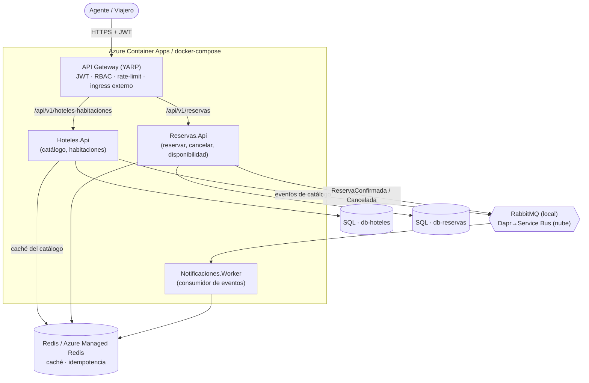

<div align="center">

# 🏨 hotel-booking-hub

**Sistema de gestión y reserva de hoteles** — back end distribuido, orientado a eventos, para una agencia de viajes.

Prueba técnica · Back End Developer · **UltraGroup** (Tech, Travel & Loyalty)


</div>

---

> **Este documento responde: qué es, cómo se ejecuta y por qué se decidió así.** Para el detalle de cada decisión → [`docs/adr/`](docs/adr/). Para el contrato/planificación → [Mapa de documentación](#dónde-está-x-mapa-de-documentación).

> **Estado:** implementado y verificado. Núcleo de dominio + mensajería (Épicas 1-6, 9), observabilidad (7) y nube por IaC (8) completos; despliegue **probado de verdad** en Azure (West US 2) con CD por OIDC. `docker compose up` levanta el sistema **funcional end-to-end en local** (un comando). Épica T (entrega) en curso.

## Contexto del proyecto

`hotel-booking-hub` es el back end de una agencia de viajes para **publicar hoteles y su inventario, buscar disponibilidad y gestionar reservas**, con un ciclo de cancelación auditado y notificaciones por evento. Es un sistema **distribuido y orientado a eventos** (no un CRUD monolítico): el estado de negocio se protege con invariantes fuertes (**no hay overbooking**) y los efectos secundarios (notificar) viajan de forma **asíncrona y sin pérdida**.

**Actores.** *Agente* (gestiona hoteles/habitaciones y sus reservas; ve solo lo suyo) y *Viajero* (busca disponibilidad y reserva). Autenticados por **JWT**, autorizados por **rol (RBAC)** en el borde y en cada servicio.

**Capacidades núcleo:**

| Área | Qué hace | Dónde vive |
|---|---|---|
| **Catálogo** | Alta/edición/baja lógica de hoteles y habitaciones, habilitar/deshabilitar; concurrencia optimista (`rowVersion`); **consulta** (lista + detalle) **paginada y aislada por agente**, con **caché Redis** de las listas (invalidación por generación → sin datos obsoletos) | `Servicios/Hoteles` |
| **Disponibilidad** | Búsqueda por ciudad/fechas/huéspedes sobre un read-model proyectado del catálogo, con caché Redis | `Servicios/Reservas` (`BuscarDisponibilidad`, `Proyeccion`) |
| **Reserva** | Crear-confirmar con **anti-overbooking** (una sola confirmación bajo concurrencia) e **idempotencia** por `Idempotency-Key` | `Servicios/Reservas` (`CrearReserva`) |
| **Cancelación** | Dos pasos (solicitud→resolución) o atajo de un paso; penalidad congelada + discreción del agente; auditada | `Servicios/Reservas` (`SolicitarCancelacion`, `ResolverCancelacion`, `CancelarEnUnPaso`) |
| **Notificaciones** | Consume los eventos de integración (confirmación/cancelación) y notifica, **idempotente y sin pérdida** | `Servicios/Notificaciones` (Worker) |

**Forma técnica:** 2 Bounded Contexts (Hoteles, Reservas) + **Gateway** (YARP, único ingress externo) + **Worker**, comunicados por **eventos** (Transactional Outbox → RabbitMQ local / Dapr→Service Bus nube). Cada servicio es **Clean Architecture + DDD + CQRS** (mediador propio). Observabilidad por **OpenTelemetry** de punta a punta.

> Para profundizar sin perderte: la tabla [**Decisiones y por qué**](#decisiones-y-por-qué) da el porqué de cada elección con enlace a su ADR; el [**mapa de documentación**](#dónde-está-x-mapa-de-documentación) dice exactamente dónde está cada cosa; y el [**árbol de carpetas**](#árbol-de-carpetas) mapea el código a bajo nivel.

## Decisiones y por qué

| # | Decisión | Trade-off / por qué | ADR |
|---|----------|---------------------|-----|
| 1 | **2 microservicios (Hoteles, Reservas) + Gateway + Worker** por Bounded Context | (+) escala/deploy independiente, límites claros · (−) consistencia eventual → mitigada con Outbox + proyecciones | [ADR-001](docs/adr/ADR-001-arquitectura-de-microservicios-por-bounded-context.md) |
| 2 | **Anti-overbooking por slots + índice único** (READ COMMITTED, no SERIALIZABLE) | el `UNIQUE(HabitacionId, Noche)` arbitra el conflicto en el INSERT sin bloquear de más | [ADR-003](docs/adr/ADR-003-sql-server-con-anti-overbooking-por-slots-de-inventario.md) · [ADR-016](docs/adr/ADR-016-arbitraje-del-invariante-por-ndice-nico-read-committed-en-ve.md) |
| 3 | **Transactional Outbox + idempotencia** | entrega at-least-once sin 2PC; el consumidor dedup por inbox | [ADR-004](docs/adr/ADR-004-transactional-outbox-idempotencia.md) |
| 4 | **CQRS con mediator propio** (sin MediatR) | control total del pipeline, sin licencia; contrato explícito | [ADR-005](docs/adr/ADR-005-cqrs-con-mediator-propio.md) · [ADR-018](docs/adr/ADR-018-contrato-del-mediator-propio-y-atomicidad-del-outbox.md) |
| 5 | **Transporte por Strategy según entorno** — RabbitMQ directo local / Dapr→Service Bus nube, tras `IPublicadorEventos` | el dominio no conoce el transporte; local corre end-to-end sin sidecars | [ADR-019](docs/adr/ADR-019-transporte-de-eventos-por-strategy-seg-n-entorno-rabbitmq-lo.md) |
| 6 | **Cero secretos en repo** — `random_password` + Key Vault + Managed Identity/OIDC | passwordless; verificado por gitleaks en CI; `.env` gitignored | [ADR-020](docs/adr/ADR-020-gesti-n-de-secretos-por-entorno-env-vars-local-dapr-secrets.md) · [ADR-022](docs/adr/ADR-022-state-remoto-de-terraform-por-bootstrap-az-backend-aad-dos-r.md) |
| 7 | **Nube por Terraform (ACA) + CD por OIDC**, ciclo apply→smoke→destroy de bajo costo | IaC reproducible, sin click-ops; gate humano = aprobación de PR en `main` | [ADR-008](docs/adr/ADR-008-azure-container-apps-terraform-con-criterio-de-migraci-n-a-a.md) · [ADR-021](docs/adr/ADR-021-cd-por-oidc-federated-despliegue-on-demand-con-aprobaci-n-ce.md) |

Registro completo (23 ADRs): [`docs/adr/`](docs/adr/README.md).

## Arquitectura (C4 · contenedores)



> El transporte es RabbitMQ directo en local (corre end-to-end, verificado) y **Dapr→Service Bus en nube** (adaptador `PublicadorEventosDapr` + suscripción Dapr del worker, seleccionados por entorno; verificación de runtime en el deploy de nube por el CD). Ver [ADR-019](docs/adr/ADR-019-transporte-de-eventos-por-strategy-seg-n-entorno-rabbitmq-lo.md).

## Ejecutar en local (un comando)

Requiere Docker. Copia `deploy/.env.example` → `deploy/.env` y define `MSSQL_SA_PASSWORD` y `JWT_SIGNING_KEY`.

```bash
docker compose -f deploy/docker-compose.yml up -d --build
# Gateway en http://localhost:8080  ·  /health anónimo
# Dashboard OTel (trazas/métricas): http://localhost:18888
# RabbitMQ management UI:            http://localhost:15672  (usuario/clave: guest/guest)
# API docs (OpenAPI + UI Scalar):
#   Hoteles  → http://localhost:8081/scalar   (spec: /openapi/v1.json)
#   Reservas → http://localhost:8082/scalar   (spec: /openapi/v1.json)
```

Levanta Gateway + Hoteles + Reservas + Worker + SQL×2 + Redis + RabbitMQ + dashboard OTel; las migraciones EF se aplican al arranque (`AplicarMigraciones`). El flujo crear hotel→habitación→reserva→cancelar funciona end-to-end, con la notificación disparada por RabbitMQ. La colección [`postman/`](postman/) ejercita el flujo (auth JWT incluida).

**¿Dónde veo las notificaciones?** El requisito de "notificar por correo" (HU2) se implementa con el patrón puerto/adaptador: `INotificador` con un adaptador de Fase 1 **`NotificadorConsola`** que **escribe el correo en el log** (evita depender de un SMTP real y de secretos en una prueba). Se ven con `docker compose -f deploy/docker-compose.yml logs notificaciones` (líneas `NotificadorConsola`). Cambiar a envío real (SMTP/MailHog/SendGrid) es un swap de una línea de DI, sin tocar el dominio. El broker RabbitMQ (transporte del evento) es visible en su management UI (arriba).

> **Nota de puertos:** el AMQP de RabbitMQ (5672) **no** se publica al host (en Windows suele chocar con un rango reservado de WSL/Hyper-V); los servicios lo usan por la red interna del compose. Solo se publica la **management UI** (15672).

**Documentación de la API (OpenAPI/Swagger, ADR-011):** cada servicio expone su **spec OpenAPI** (`/openapi/v1.json`) y una **UI Scalar** navegable (`/scalar`) en los puertos 8081 (Hoteles) y 8082 (Reservas). Se activa en Development y en el compose (flag `ExponerOpenApi`); en Azure/ACA **no** se expone (higiene de producción — no publicar la superficie de la API). El tráfico de negocio siempre entra por el Gateway (`:8080`), con JWT.

## Nube (Azure) e IaC

Todo por Terraform (`deploy/terraform/`, ADR-008): ACA + Dapr/KEDA, Azure SQL×2, Azure Managed Redis, Service Bus, Key Vault, App Insights, ACR, Managed Identity. Despliegue **probado de verdad** en West US 2 (ciclo apply→smoke→destroy). CD por OIDC **on-demand** (`workflow_dispatch`) — passwordless, con `main` protegida (aprobación de PR); mergear a `main` no despliega por sí solo (ADR-021). Runbook y setup: [`deploy/terraform/README.md`](deploy/terraform/README.md).

## Árbol de carpetas

Mapa a bajo nivel. Cada BC repite el mismo layout de **Clean Architecture** (`Domain` → `Application` → `Infrastructure` → `Api`), con la capa de aplicación organizada en **slices verticales por caso de uso** (CQRS).

```
├─ HotelBookingHub.slnx            # solución (formato .slnx)
├─ Directory.Packages.props        # versiones centralizadas de NuGet (Central Package Mgmt)
├─ Directory.Build.props           # TreatWarningsAsErrors, Nullable, langversion (todo el repo)
│
├─ src/
│  ├─ ApiGateway/                  # YARP: único ingress externo
│  │  ├─ Program.cs                #   auth JWT + RBAC + rate-limit + CORS + HSTS + MapReverseProxy
│  │  └─ appsettings.json          #   ReverseProxy: rutas hoteles/habitaciones/disponibles/reservas → clusters
│  │
│  ├─ Comun/
│  │  ├─ HotelBookingHub.Comun/            # sin dependencias de web
│  │  │  ├─ Mensajeria/            #   mediador propio (ISender/IRequest) + Behaviors (Validation, Transaction, Tracing)
│  │  │  ├─ Eventos/               #   contratos de eventos de integración (EventoIntegracion, ReservaConfirmadaV1…)
│  │  │  ├─ Resultados/            #   Result / Result<T> (patrón Result, sin excepciones de control)
│  │  │  ├─ Observabilidad/        #   ActivitySource "HotelBookingHub", correlación de traza
│  │  │  └─ Excepciones/
│  │  └─ HotelBookingHub.Comun.Web/        # transversales HTTP
│  │     └─ Seguridad/             #   AddAutenticacionJwt, políticas RBAC (SoloAgente / AgenteOViajero), IContextoAgente
│  │
│  ├─ AppHost/
│  │  ├─ AppHost/                  # Aspire: orquesta servicios + SQL/Redis/RabbitMQ en local dev
│  │  └─ ServiceDefaults/          # OpenTelemetry + health checks + service discovery + resiliencia
│  │
│  └─ Servicios/
│     ├─ Hoteles/                  # ── BC Catálogo ──
│     │  ├─ Hoteles.Domain/        #   Hoteles/ · Habitaciones/ (agregados, invariantes) · Puertos/
│     │  ├─ Hoteles.Application/   #   slices: CrearHotel · EditarHotel · EliminarHotel · CambiarEstadoHotel
│     │  │                         #          CrearHabitacion · EditarHabitacion · CambiarEstadoHabitacion
│     │  │                         #          ListarHoteles · ListarHabitaciones (+ detalle) — lectura paginada
│     │  ├─ Hoteles.Infrastructure/#   Persistencia (EF) · Migraciones · Outbox · Mensajeria (RabbitMQ/Dapr) · Cache (Redis del catálogo)
│     │  └─ Hoteles.Api/           #   Program.cs (Minimal API, endpoints /api/v1/hoteles·habitaciones)
│     │
│     ├─ Reservas/                 # ── BC Reservas (anti-overbooking, cancelación) ──
│     │  ├─ Reservas.Domain/       #   Reservas/ (agregado, máquina de estados) · Servicios/ (precio, penalidad) · Puertos/
│     │  ├─ Reservas.Application/  #   slices: CrearReserva · BuscarDisponibilidad · ListarReservasDelAgente
│     │  │                         #          ObtenerReservaDetalle · SolicitarCancelacion · ResolverCancelacion
│     │  │                         #          CancelarEnUnPaso · ListarCancelacionesPendientes
│     │  ├─ Reservas.Infrastructure/#  Persistencia · Migraciones · Outbox · Cache (Redis) · Idempotencia
│     │  │                         #   Disponibilidad · Proyeccion (read-model del catálogo) · Mensajeria
│     │  └─ Reservas.Api/          #   Program.cs + Http/ (endpoints /api/v1/reservas + disponibles)
│     │
│     └─ Notificaciones/
│        └─ Notificaciones.Worker/ #   consumidor (RabbitMQ local / suscripción Dapr nube) → Notificaciones/
│                                  #   (INotificador, inbox idempotente, dead-letter, enrutador por tipo)
│
├─ tests/
│  ├─ *.UnitTests/                 # Hoteles · Reservas · Notificaciones · Comun.Web (xUnit; dominio, handlers, RBAC, traza)
│  ├─ *.IntegrationTests/          # Hoteles · Reservas · Notificaciones (Testcontainers: SQL/Redis/RabbitMQ reales)
│  ├─ *.FunctionalTests/           # Hoteles · Reservas · Seguridad (WebApplicationFactory: borde HTTP y del Gateway)
│  ├─ Contracts/                   # tests de contrato de los eventos de integración
│  └─ TestKit.Auth/                # helper de emisión de JWT de prueba
│
├─ deploy/
│  ├─ docker-compose.yml           # stack local funcional: gateway+3 servicios+SQL×2+Redis+RabbitMQ+OTel (ADR-007)
│  ├─ .env.example                 # plantilla (MSSQL_SA_PASSWORD, JWT_SIGNING_KEY); el .env real está gitignored
│  ├─ terraform/                   # IaC Azure (ADR-008)
│  │  ├─ main·apps·data·keyvault·registry·observability.tf   # ACA/Dapr, SQL, Redis, Service Bus, KV, ACR, App Insights
│  │  ├─ providers·versions·variables·outputs.tf
│  │  ├─ bootstrap/                #   crea el Storage del tfstate remoto (huevo-gallina, ADR-022)
│  │  └─ README.md                 #   runbook de despliegue + setup OIDC del CD
│  ├─ scripts/                     # deploy · destroy · build-push · migrate · smoke · mint-jwt (reusados por el CD)
│  └─ dapr/                        # componentes Dapr: pubsub.yaml · statestore.yaml (referencia de nube)
│
├─ docs/
│  ├─ adr/                         # 23 ADRs como archivos (Contexto·Decisión·Consecuencias) + índice
│  ├─ seguridad.md                 # 8 prácticas de seguridad → OWASP
│  ├─ uso-de-ia.md                 # cómo se usó la IA (método BMAD, de punta a punta)
│  ├─ observabilidad.md            # trazas distribuidas + métricas p95/p99 + transporte de eventos
│  ├─ bdd-y-e2e.md                 # flujos BDD (Given/When/Then) + estrategia de pruebas E2E
│  ├─ specs/                       # SPEC (contrato máquina) + decisions-adr.md (origen de los ADR)
│  ├─ planning-artifacts/          # prds/ · architecture.md · epics.md · sprint-change-proposals
│  ├─ implementation-artifacts/    # historias (una por archivo) · sprint-status.yaml · deferred-work.md · evidencia/
│  └─ DOCUMENTO-BASE.md            # documento base consolidado
│
└─ .github/workflows/
   ├─ ci.yml                       # build · format · test (+ G1 aislado) · gitleaks · terraform · smoke-compose+Newman
   └─ cd.yml                       # despliegue on-demand a Azure por OIDC (workflow_dispatch: deploy/destroy)
```

## ¿Dónde está X? (mapa de documentación)

| Si quieres… | Ve a |
|---|---|
| Las **decisiones** y su porqué | [`docs/adr/`](docs/adr/README.md) |
| **Ejecutar** local | [arriba](#ejecutar-en-local-un-comando) · `deploy/docker-compose.yml` |
| **Desplegar** a Azure / CD | [`deploy/terraform/README.md`](deploy/terraform/README.md) |
| **Seguridad** (OWASP) | [`docs/seguridad.md`](docs/seguridad.md) |
| **Uso de IA** (método BMAD) | [`docs/uso-de-ia.md`](docs/uso-de-ia.md) |
| El **contrato** y requisitos | [`docs/specs/`](docs/specs/) · [`docs/DOCUMENTO-BASE.md`](docs/DOCUMENTO-BASE.md) |
| **Observabilidad** | [`docs/observabilidad.md`](docs/observabilidad.md) |
| **Pruebas** (BDD + E2E) | [`docs/bdd-y-e2e.md`](docs/bdd-y-e2e.md) |
| El **backlog** (31 historias, no es lectura de evaluación) | [`docs/planning-artifacts/epics.md`](docs/planning-artifacts/epics.md) |

## Stack

.NET 10 · C# · Clean Architecture + DDD + CQRS · SQL Server / Azure SQL · Redis / Azure Managed Redis · RabbitMQ (local) / Dapr→Service Bus (nube) · YARP · OpenTelemetry · EF Core · Terraform · Azure Container Apps · GitHub Actions.
