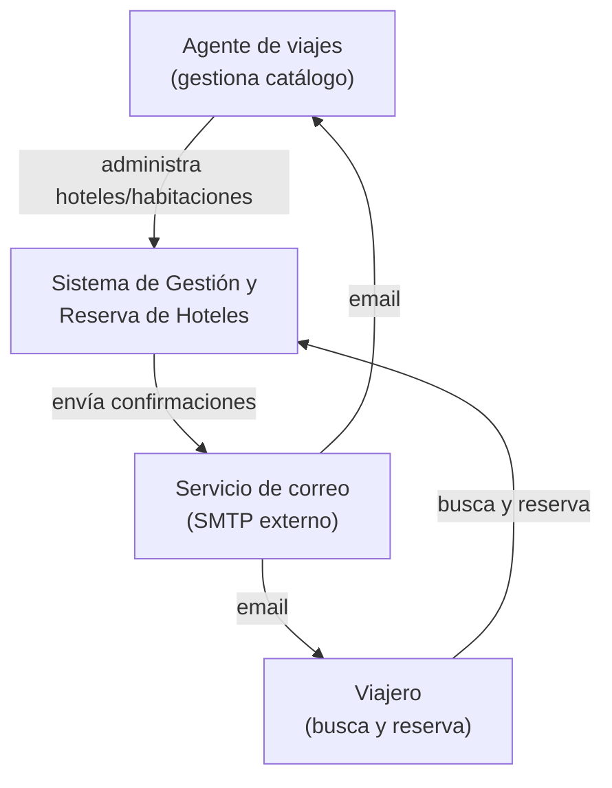
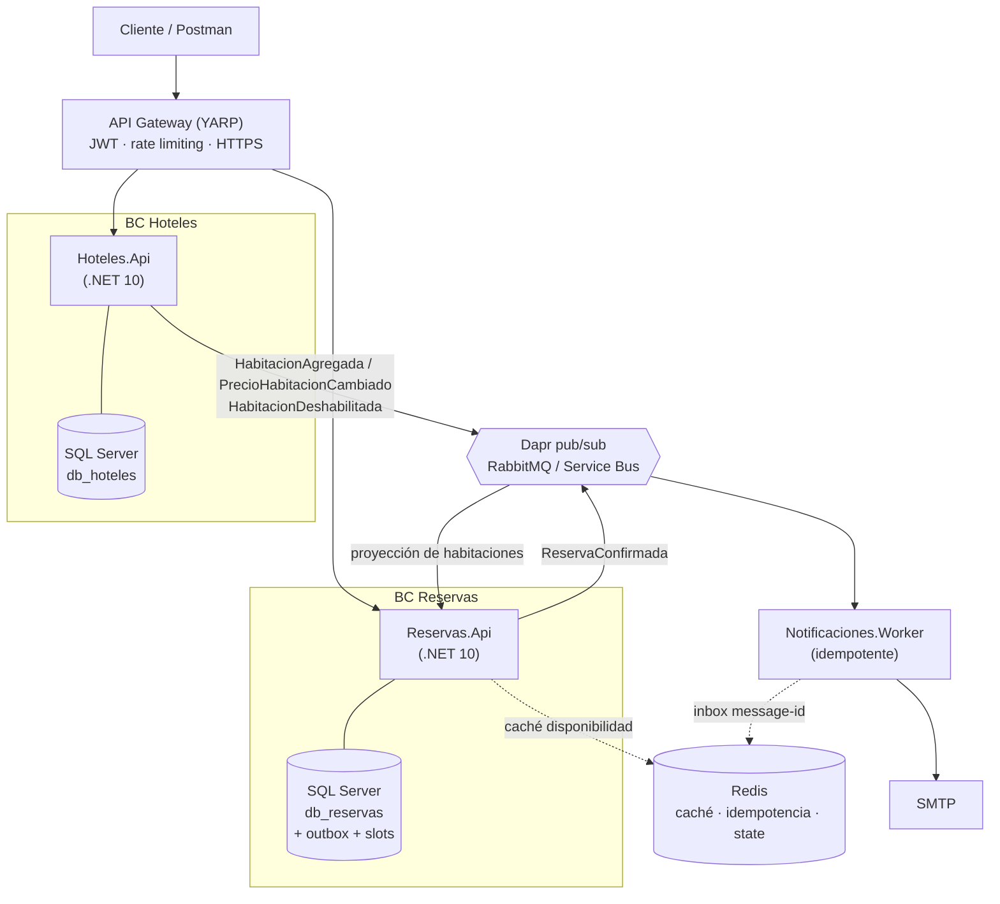

# Documento Base del Proyecto — Sistema de Gestión y Reserva de Hoteles

> **Prueba técnica Back End Developer · UltraGroup (Tech, Travel & Loyalty)**
> Documento único de fundación: consolida los requisitos de la prueba, la inteligencia de la vacante, las decisiones de arquitectura acordadas, las convenciones de código, el plan de trabajo.
>
> **Estado:** base aprobada · **Fase actual:** 0 (documentación, previa a la creación del repositorio).
> **Proyecto/repo:** `hotel-booking-hub` · https://github.com/SantiagoRenteria/hotel-booking-hub
> **Idioma:** documentación y **código de dominio en español** (identificadores sin tildes; sufijos de patrón en inglés por convención — ver §10.1).

> **⚙️ Nota de reconciliación (2026-07-10).** Durante la fase de arquitectura e implementación se tomaron dos decisiones que **superan** definiciones iniciales de este documento; las secciones afectadas se corrigieron en línea (marcadas *[Corregido …]*):
> - **Aislamiento del anti-overbooking:** `SERIALIZABLE` → **READ COMMITTED + índice único** que arbitra el conflicto en el INSERT (**ADR-016**). Menos deadlocks, mejor p95/p99; el `UNIQUE (HabitacionId, Noche)` ya garantiza cero overbooking. §8.4/§8.5/§8.8 y ADR-003 corregidos.
> - **Transporte de eventos por entorno (patrón Strategy):** **RabbitMQ directo en local** (adaptador tras `IPublicadorEventos`) y **Dapr pub/sub → Service Bus en nube** (**ADR-019/020**). El "cero cambios de código, solo el YAML" aplica al salto de broker **dentro de Dapr en nube**, no al salto local↔nube. §5/§6/§7/§8.6 y ADR-002 corregidos.
> - **Registro de ADRs:** los ADR reales del repo van del 001 al 020 (014–018 de la fase de arquitectura; 019–020 de la reconciliación de transporte). Los ADR completos viven en `docs/specs/spec-hotel-booking-hub/decisions-adr.md` (y se publicarán como archivos en `docs/adr/` en la Épica T).

---

## Tabla de contenido

1. [Resumen ejecutivo](#1-resumen-ejecutivo)
2. [Contexto y objetivo](#2-contexto-y-objetivo)
3. [Requisitos funcionales](#3-requisitos-funcionales)
4. [Requisitos de entrega](#4-requisitos-de-entrega)
5. [Retos diferenciadores y su abordaje](#5-retos-diferenciadores-y-su-abordaje)
6. [Stack y restricciones técnicas](#6-stack-y-restricciones-técnicas)
7. [Decisiones de arquitectura — resumen](#7-decisiones-de-arquitectura--resumen)
8. [Arquitectura de la solución (detallada)](#8-arquitectura-de-la-solución-detallada)
9. [Registro de decisiones (ADRs)](#9-registro-de-decisiones-adrs)
10. [Convenciones de código y estándares](#10-convenciones-de-código-y-estándares)
11. [Calidad, seguridad y cumplimiento](#11-calidad-seguridad-y-cumplimiento)
12. [Estrategia de pruebas (TDD)](#12-estrategia-de-pruebas-tdd)
13. [Plan por fases y entregables](#13-plan-por-fases-y-entregables)
14. [Trazabilidad requisito → solución](#14-trazabilidad-requisito--solución)
15. [Preguntas de diseño](#15-preguntas-de-diseño)
16. [Uso de IA en el desarrollo (BMAD)](#16-uso-de-ia-en-el-desarrollo-bmad)
17. [Decisiones abiertas / pendientes](#17-decisiones-abiertas--pendientes)

---

## 1. Resumen ejecutivo

Se construye el back end de una plataforma de alojamiento para una agencia de viajes. El sistema resuelve dos capacidades: **administración del catálogo de hoteles/habitaciones** (rol Agente) y **búsqueda y reserva de habitaciones** (rol Viajero), con **notificación por correo** al confirmar una reserva.

La solución se diseña como **dos microservicios** alineados a dos *Bounded Contexts* (Hoteles y Reservas), un **API Gateway**, y un **worker de notificaciones** que consume eventos de dominio. El corazón técnico —y el diferenciador de nivel senior— es garantizar **cero overbooking** bajo concurrencia y **entrega de eventos sin pérdida ni duplicación**.

La estrategia de ejecución es **core blindado primero**, diferenciadores de alto valor después, y nube al final con compuerta, de modo que la ambición (Azure/Terraform) nunca ponga en riesgo la entrega base.

---

## 2. Contexto y objetivo

Una agencia de viajes necesita modernizar su plataforma de alojamiento. Hoy gestiona hoteles y reservas de forma manual, lo que genera inconsistencias, pérdida de comisiones y mala experiencia para los viajeros. El objetivo es diseñar e implementar la **solución back end** de forma **robusta, escalable y mantenible**.

> **Criterio de evaluación clave (textual del enunciado):** *"No se espera perfección en todos los frentes: se valorará la claridad del razonamiento detrás de las decisiones tomadas."* → La estrategia ganadora es **core impecable + pocos retos con profundidad real + documentación que justifica cada decisión** (incluidas las de no hacer algo).

---

## 3. Requisitos funcionales

### Historia de usuario 1 — Administración de hoteles
> *Como agente de viajes, quiero gestionar el catálogo de hoteles y habitaciones para maximizar las comisiones de mi agencia.*

**Criterios de aceptación obligatorios:**

| # | Criterio |
|---|----------|
| HU1-1 | Crear, editar y eliminar (**lógicamente**) un hotel con al menos: nombre, ciudad, dirección, descripción y estado (habilitado/deshabilitado). |
| HU1-2 | Asignar habitaciones a un hotel registrando: tipo de habitación, costo base, impuestos, ubicación dentro del hotel y estado (habilitada/deshabilitada). |
| HU1-3 | Modificar los valores de un hotel y de cada habitación de forma independiente. |
| HU1-4 | Habilitar o deshabilitar hoteles y habitaciones individualmente. |
| HU1-5 | Listar las reservas realizadas en los hoteles del agente y mostrar el detalle de cada una. |

### Historia de usuario 2 — Reserva de habitaciones
> *Como viajero, quiero buscar y reservar una habitación de hotel para obtener alojamiento de forma ágil y recibir confirmación inmediata.*

**Criterios de aceptación obligatorios:**

| # | Criterio |
|---|----------|
| HU2-1 | Endpoint de búsqueda que filtre habitaciones disponibles por: **ciudad de destino, fecha de entrada, fecha de salida y cantidad de huéspedes**. |
| HU2-2 | Seleccionar una habitación disponible e iniciar el proceso de reserva. |
| HU2-3 | Registrar los datos completos de cada huésped: nombres y apellidos, fecha de nacimiento, género, tipo y número de documento, email y teléfono de contacto. |
| HU2-4 | Registrar un **contacto de emergencia** (nombre completo y teléfono) por reserva. |
| HU2-5 | **Notificar al huésped y al agente por correo electrónico** al confirmar una reserva. |

---

## 4. Requisitos de entrega

| Requisito | Cómo se cumple |
|-----------|----------------|
| Código fuente en repositorio **público** (GitHub) | Repo público sin dependencias privadas (ver [ADR-009](#adr-009--sin-dependencias-privadas)). |
| **README.md** con instrucciones de ejecución local, decisiones de arquitectura, ADRs y diagramas C4 | README derivado de este documento + `docs/`. |
| Documentar prácticas de seguridad aplicadas y por qué | §8.10 y §11. |
| Documentar el uso de herramientas de IA | §16 (flujo BMAD). |
| **Colección Postman** o equivalente para los flujos principales | Colección versionada + ejecución en CI con **Newman**. |
| **docker-compose** funcional | `docker-compose.yml` reproducible (ver [ADR-007](#adr-007--aspire-para-desarrollo--docker-compose-para-reproducibilidad)). |

---

## 5. Retos diferenciadores y su abordaje

Los retos son **opcionales**; representan la oportunidad de demostrar profundidad. Marcamos cuáles abordamos y cómo.

| Reto (del enunciado) | ¿Se aborda? | Cómo |
|----------------------|:-----------:|------|
| **Arquitectura de microservicios** (≥2 dominios, contratos OpenAPI, trade-offs) | ✅ | 2 microservicios por BC + Gateway; contratos OpenAPI; trade-offs en [ADR-001](#adr-001--arquitectura-de-microservicios-por-bounded-context). |
| **Mensajería con RabbitMQ** (evento + notificaciones + fallos/reintentos) | ✅ | *[Corregido — ADR-019]* Evento `ReservaConfirmada` por **RabbitMQ**: transporte **directo en local** (adaptador tras `IPublicadorEventos`) y **Dapr pub/sub → Service Bus en nube**, seleccionado por entorno (patrón Strategy); Outbox + idempotencia + dead-letter; §8.6. |
| **Seguridad en el backend** (JWT/OAuth2 + ≥3 prácticas) | ✅ | JWT/OIDC + RBAC + **8 prácticas** mapeadas a **OWASP Top 10**; §8.10, §11. |
| **IA en el desarrollo — uso de herramientas** | ✅ | Flujo BMAD documentado; §16. |
| **IA en el desarrollo — generación asistida de código** | ✅ | Casos con prompts y verificación documentados; §16. |
| **TDD** (flujo crítico Red-Green-Refactor, commits) | ✅ | Flujo crítico *cálculo de precio + crear reserva* con ciclo TDD; §12. |
| **DDD** (≥2 Bounded Contexts, entities, value objects, aggregates, domain events) | ✅ | §8.3–8.4. |
| **Telemetría y Observabilidad** (OpenTelemetry, métricas, logs) | ✅ | OTel vía Aspire → App Insights; §8.11. |
| **Clean Code y patrones** (SOLID + ≥1 patrón) | ✅ | Catálogo completo (Factory, Strategy, Specification, Repository, Decorator, Result, CQRS, Outbox...); §8.14. |

---

## 6. Stack y restricciones técnicas

| Aspecto | Decisión | Justificación breve |
|---------|----------|---------------------|
| Lenguaje / Framework | **C# · .NET 10** (Minimal API, sin MVC) | Requisito del enunciado; satisface ".NET 8 o superior" de la vacante; features modernas. |
| Motor transaccional | **SQL Server** (una BD por microservicio) | Es el motor del stack de UltraGroup; consistencia fuerte para reservas (ver §8.8 y [ADR-003](#adr-003--sql-server-con-anti-overbooking-por-slots-de-inventario)). |
| Caché / state / idempotencia | **Redis** | Caché de disponibilidad, store de idempotencia (inbox) y Dapr state store ([ADR-012](#adr-012--redis-para-cach%C3%A9-idempotencia-y-state)). |
| ORM | **EF Core 10** (code-first + migraciones) | Estándar, tracking de entidades DDD, provider SQL Server. |
| API | **REST** documentada con **OpenAPI**; UI con **Scalar** | El estándar OpenAPI cumple el requisito "OpenAPI/Swagger" ([ADR-011](#adr-011--openapi-como-contrato-scalar-como-ui)). |
| Mensajería / runtime distribuido | *[Corregido — ADR-019/020]* **RabbitMQ directo** en local; **Dapr** (pub/sub + secrets) en nube | Patrón Strategy por entorno tras el puerto `IPublicadorEventos`: el dominio no cambia; Dapr aporta cloud-agnostic + secrets en ACA ([ADR-002](#adr-002--dapr-como-runtime-de-pubsub-y-secretos) refinado por ADR-019/020). |
| Broker | **RabbitMQ** (local, cliente directo) / **Azure Service Bus** (nube, vía Dapr) | En nube el broker es intercambiable por *component* Dapr sin tocar código; en local se usa el adaptador RabbitMQ directo. |
| Validación | **FluentValidation** | Validación declarativa de inputs (anti-inyección, OWASP A03). |
| Testing | **xUnit** + EF Core InMemory + **Testcontainers.MsSql** | TDD obligatorio; integración con SQL Server real en contenedor. |
| Pruebas de API | **Postman + Newman** | Colección versionada, ejecutada en CI con Newman. |
| Orquestación local | **.NET Aspire** | Dev-loop + dashboard OpenTelemetry + wiring automático. |
| Reproducibilidad | **docker-compose** | Requisito de entrega; el evaluador no necesita Aspire. |
| Nube | **Azure Container Apps** provisionado con **Terraform** | IaC + Dapr gestionado + escalado por réplicas (KEDA). |

> **MongoDB** aparece en el stack de la empresa; se documenta como **evolución** (read model NoSQL para búsqueda a gran escala vía CQRS), pero **no se implementa** en esta entrega para controlar el alcance (ver §8.8 y §17).

---

## 7. Decisiones de arquitectura — resumen

| Área | Decisión final | ADR |
|------|----------------|-----|
| Estilo | 2 microservicios (BC Hoteles + BC Reservas) + Gateway YARP + Notificaciones worker | [001](#adr-001--arquitectura-de-microservicios-por-bounded-context) |
| Diseño interno | Clean Architecture + DDD (patrones, **sin** paquetes privados) | [009](#adr-009--sin-dependencias-privadas) |
| CQRS | Command/Query + **mediator propio minimalista** (no MediatR, no Wolverine) | [005](#adr-005--cqrs-con-mediator-propio) |
| Mensajería/infra | *[Corregido]* **RabbitMQ directo (local) / Dapr→Service Bus (nube)** por entorno, tras `IPublicadorEventos` | [002](#adr-002--dapr-como-runtime-de-pubsub-y-secretos) + **019/020** |
| Motor transaccional | **SQL Server** + **anti-overbooking por slots de inventario + UNIQUE** | [003](#adr-003--sql-server-con-anti-overbooking-por-slots-de-inventario) |
| Caché / state | **Redis** (caché, idempotencia, Dapr state) | [012](#adr-012--redis-para-cach%C3%A9-idempotencia-y-state) |
| Consistencia eventos | **Transactional Outbox** + **idempotencia** (inbox por message-id en Redis) | [004](#adr-004--transactional-outbox--idempotencia) |
| Resiliencia | Circuit breaker (Polly/Http.Resilience) donde el fallo externo es real | [010](#adr-010--resiliencia-selectiva) |
| Auth | **JWT propio OIDC** + RBAC server-side (roles Agente/Viajero) | [006](#adr-006--jwt-propio-oidc--rbac) |
| Dev/Deploy | Aspire (dev + observabilidad) + docker-compose (reproducible) | [007](#adr-007--aspire-para-desarrollo--docker-compose-para-reproducibilidad) |
| Nube | Azure Container Apps + Terraform (Fase 3, con compuerta) | [008](#adr-008--azure-container-apps--terraform) |
| API docs | OpenAPI (contrato) + Scalar (UI) | [011](#adr-011--openapi-como-contrato-scalar-como-ui) |

---

## 8. Arquitectura de la solución (detallada)

### 8.1 Estilo arquitectónico

- **Microservicios por Bounded Context**, comunicación **asíncrona por eventos** (Event Driven; sin acoplamiento síncrono entre dominios).
- **Clean Architecture** dentro de cada servicio: dependencias apuntan hacia adentro `Domain ← Application ← Infrastructure ← API`. El dominio define **puertos** (interfaces de repositorio y mensajería); EF Core, Dapr, Redis y SMTP son sus **adaptadores** en infraestructura.
- **API Gateway (YARP)** como punto único de entrada: enrutamiento, autenticación JWT, rate limiting, HTTPS enforcement.

### 8.2 Diagramas C4

**Nivel 1 — Contexto:**



**Nivel 2 — Contenedores:**



### 8.3 Bounded Contexts y lenguaje ubicuo

Dos contextos con lenguaje y responsabilidades separadas. Sin FK físicas entre servicios; el cruce se resuelve por **proyecciones** alimentadas por eventos.

| Concepto (negocio) | Término ubicuo (código, español sin tildes) | BC |
|--------------------|--------------------------------|----|
| Hotel | `Hotel` | Hoteles |
| Habitación | `Habitacion` | Hoteles |
| Tipo de habitación | `TipoHabitacion` | Hoteles |
| Reserva | `Reserva` | Reservas |
| Huésped | `Huesped` | Reservas |
| Contacto de emergencia | `ContactoEmergencia` | Reservas |
| Estancia (rango de fechas) | `Estancia` / `RangoFechas` | Reservas |
| Disponibilidad | `Disponibilidad` | Reservas |
| Noche de habitación (slot) | `NocheHabitacion` | Reservas |
| Agente | `Agente` (rol) | ambos |
| Viajero | `Viajero` (rol) | Reservas |

**Límites (respuesta a "¿dónde van los límites de un BC?"):** el BC **Hoteles** (catálogo) habla el lenguaje del *agente* (gestión, comisiones, estados de publicación). **Reservas** habla el lenguaje del *viajero* (disponibilidad, estancia, huésped). El invariante de no-overbooking pertenece **solo** a Reservas; el precio base y los impuestos nacen en Hoteles y llegan a Reservas como dato proyectado.

### 8.4 Modelo de dominio

**BC Hoteles (`Hoteles.Api`)**
- **Aggregate root:** `Hotel` (contiene sus `Habitacion` como entidades hijas).
- **Value Objects:** `Direccion` (ciudad, linea, ...), `Dinero` (costoBase), `Impuesto`, `TipoHabitacion`, `UbicacionHabitacion`.
- **Domain events:** `HotelCreado`, `HotelDeshabilitado`, `HabitacionAgregada`, `PrecioHabitacionCambiado`, `HabitacionDeshabilitada`.
- **Invariantes:** una habitación deshabilitada o de un hotel deshabilitado no puede ofertarse.

**BC Reservas (`Reservas.Api`)**
- **Aggregate root:** `Reserva` (contiene `Huesped`(es), `ContactoEmergencia`, `Estancia`).
- **Value Objects:** `Estancia` (entrada, salida — `DateOnly`), `NumeroHuespedes`, `ContactoEmergencia`, `Documento` (tipo + numero), `Dinero`.
- **Slots de inventario:** `NocheHabitacion` (habitacionId, noche, reservaId) con `UNIQUE(habitacionId, noche)` — mecanismo anti-overbooking (§8.5).
- **Read model:** `ProyeccionHabitacion` (copia local read-only de habitaciones: id, hotelId, ciudad, tipo, costoBase, impuesto, capacidad, activa) actualizada por eventos de Hoteles vía Dapr. Consultas optimizadas con índices + `AsNoTracking()`; **Redis** cachea resultados de búsqueda.
- **Domain events:** `ReservaConfirmada` (dispara notificaciones).
- **Invariante central:** no pueden existir dos reservas activas para la misma `HabitacionId` con `Estancia` solapada (ver §8.5).

**BC Notificaciones (`Notificaciones.Worker`)**
- Sin BD relacional de dominio; usa **Redis** como inbox de **idempotencia** (message-id procesados con TTL).
- Consume `ReservaConfirmada` → envía correo a huésped y agente.

**Flujo crítico de reserva:**
1. `POST /api/v1/reservas` con `HabitacionId`, `Estancia`, huéspedes y contacto de emergencia.
2. Se valida (fechas coherentes `salida > entrada`, capacidad ≥ huéspedes, habitación activa en proyección).
3. Se calcula el **precio**: `(costoBase + impuesto) × noches`.
4. En **una sola transacción** (*[Corregido — ADR-016]* **READ COMMITTED**, no SERIALIZABLE): se inserta `Reserva`, se insertan las `NocheHabitacion` de la estancia (el `UNIQUE` rechaza solapamientos en el propio INSERT → HTTP 409) **y** se escribe el evento en la tabla `outbox`.
5. El *relay* publica `ReservaConfirmada`.
6. `Notificaciones.Worker` consume (idempotente vía Redis) y envía los correos.

### 8.5 Overbooking — el problema central

El invariante ("no dos reservas solapadas de la misma habitación") se garantiza **a nivel de motor**, no con lógica de aplicación (frágil ante concurrencia). En SQL Server usamos el **patrón de slots de inventario**: una fila por noche reservada, con restricción de unicidad.

```sql
-- Una fila por (habitación, noche). La unicidad impide doble reserva de la misma noche.
CREATE TABLE NochesHabitacion (
    HabitacionId UNIQUEIDENTIFIER NOT NULL,
    Noche        DATE             NOT NULL,
    ReservaId    UNIQUEIDENTIFIER NOT NULL,
    CONSTRAINT PK_NochesHabitacion PRIMARY KEY (HabitacionId, Noche)  -- unicidad = anti-overbooking
);
```

Al confirmar una reserva, dentro de una transacción (*[Corregido — ADR-016]* **READ COMMITTED**), se insertan las noches `[entrada, salida)`. Si **alguna** ya existe, la violación de `PRIMARY KEY`/`UNIQUE` (`SqlException` 2627/2601) aborta el INSERT → **409 Conflict** (Problem Details RFC 7807), **sin retry** (determinístico: otro ganó). Solo el **deadlock 1205** se reintenta (backoff+jitter). Dos reservas concurrentes sobre la misma habitación y fechas: una gana, la otra falla limpio. Cero overbooking, garantizado por el motor, **portable** y con soporte natural para disponibilidad parcial.

> *[Corregido — ADR-016]* El `UNIQUE (HabitacionId, Noche)` **ya arbitra** el conflicto en el propio INSERT, sin necesidad de prevenir *phantom reads* → **READ COMMITTED** basta y evita los deadlocks extra y el castigo al p95/p99 que traería `SERIALIZABLE`. Alternativas descartadas (ADR-003/016): `SERIALIZABLE` (más caro, más deadlocks, sin beneficio), `sp_getapplock` por `HabitacionId` (complejidad).

**Resumen de todas las condiciones de carrera del sistema** (resueltas por diseño, no como parche):

| Condición de carrera | Mecanismo |
|----------------------|-----------|
| Overbooking (2 reservas, misma habitación/fechas) | *[Corregido — ADR-016]* Slots `NochesHabitacion` + `UNIQUE` (READ COMMITTED; el índice único arbitra) → una gana, otra `409` |
| Edición concurrente (2 agentes, mismo hotel) | Concurrencia optimista con `rowversion` → `409` + recarga |
| Evento procesado dos veces (broker *at-least-once*) | Idempotencia: inbox en Redis por `message-id` |
| Doble publicación desde el outbox | *At-least-once* + idempotencia aguas abajo lo absorbe |
| Doble envío del cliente (doble clic en "reservar") | **Idempotency-Key** en header del `POST` → devuelve la misma reserva |
| *Deadlock* SQL (1205) bajo contención | Retry acotado (3 intentos, backoff+jitter) solo para 1205; el 2627/2601 NO se reintenta (ADR-016) |

### 8.6 Consistencia y mensajería (Outbox + idempotencia + Dapr)

**No perder el evento:** patrón **Transactional Outbox**. La reserva, sus slots y su evento se escriben en la misma transacción ACID de SQL Server. Un relay lee la tabla `outbox` y publica vía Dapr. Si el broker está caído, el evento permanece en `outbox` hasta publicarse.

**No procesar dos veces:** **idempotencia** en el consumidor. `Notificaciones.Worker` registra el `message-id` en **Redis** (con TTL); si llega repetido, lo ignora. Complementado con reintentos y **DLQ** de Dapr.

**Broker por entorno (patrón Strategy tras `IPublicadorEventos`)** *[Corregido — ADR-019/020]*:
- **Local → RabbitMQ directo** (adaptador `PublicadorEventosRabbitMq` con `RabbitMQ.Client`, en docker-compose). El dominio no conoce el transporte.
- **Nube → Dapr pub/sub → Azure Service Bus** (adaptador Dapr por el mismo puerto).
- El **"cero cambios de código, solo el YAML del component"** aplica al cambio de broker **dentro de Dapr en la nube** (RabbitMQ↔Service Bus). El salto **local↔nube** selecciona el adaptador por entorno (Strategy), sin tocar el dominio ni los handlers.

**Dapr — building blocks utilizados** (modelo *sidecar*: cada servicio corre junto a un proceso Dapr que expone una API local; los sidecars hablan entre sí, desacoplando el código de la infraestructura concreta):

| Building block | ¿Se usa? | Para qué en este sistema |
|----------------|:--------:|--------------------------|
| Pub/Sub | ✅ | Eventos `ReservaConfirmada` y de catálogo; broker abstraído |
| State management | ✅ | Redis para idempotencia (inbox) y outbox |
| Secrets | ✅ | Key Vault (nube) / archivo (local) — sin credenciales en código |
| Resiliency | ✅ | Retry / circuit-breaker / timeout declarativos (YAML) |
| Observability | ✅ | Emite trazas OTel de cada salto → alimenta el tracing distribuido (§8.11) |
| Service invocation | Opcional | Llamada servicio-a-servicio con mTLS (se prefieren eventos) |
| Bindings | Opcional | Alternativa para el envío de correo (SMTP/SendGrid) |
| Actors / Workflow | ❌ | Sin caso; Workflow serviría si la reserva creciera a una *saga* |

> **Valor clave:** una sola abstracción resuelve pub/sub + secrets + state + resiliencia + observabilidad, y mantiene el sistema *cloud-agnostic*. El sidecar lo gestiona ACA en la nube y Aspire en local — no se opera a mano.

### 8.7 CQRS y mediator propio

- **Commands** (escritura): pasan por el dominio y sus invariantes (`CrearReservaCommand`, `CrearHotelCommand`, ...).
- **Queries** (lectura): optimizadas, `AsNoTracking()`, con caché Redis (`BuscarHabitacionesDisponiblesQuery`, `ObtenerReservasAgenteQuery`).
- **Mediator propio** (~30 líneas): interfaz `ISender` + `IRequestHandler<TReq,TRes>` + **pipeline de behaviors** (patrón Decorator): `ValidationBehavior` → `LoggingBehavior` → `TransactionBehavior` → `MetricsBehavior`. Sin dependencia de MediatR (licencia comercial) ni Wolverine (se solaparía con Dapr).

### 8.8 Persistencia — SQL Server (+ Redis)

**Por qué SQL Server:**
- Es el motor del stack de UltraGroup (encaje con su entorno real).
- Integridad transaccional fuerte (reserva + slots + outbox en la misma tx `SERIALIZABLE`).
- Anti-overbooking garantizado por el motor vía unicidad de slots (§8.5).
- Joins para reportes de comisiones del agente; madurez de EF Core + Testcontainers.

**Rol de Redis:** caché de resultados de búsqueda de disponibilidad (lecturas frecuentes), inbox de idempotencia del worker, y Dapr state store. No es fuente de verdad transaccional.

**Qué se sacrifica:** escalado horizontal de escritura (sharding) más simple en NoSQL, y flexibilidad de esquema. Pero **10.000 reservas/día ≈ 0,12 writes/s** promedio (picos de decenas/s) → SQL Server en una instancia sobra.

**En qué escenario cambiaría:** si la **búsqueda de disponibilidad** se vuelve el cuello de botella más allá de lo que resuelve Redis, se introduce un **read model en MongoDB** vía CQRS. Diseño completo (documentado, **no implementado** en esta entrega — ver [ADR-013](#adr-013--read-model-cqrs-en-mongodb-diferido)):

```
Comando (reservar) ─► SQL Server   (verdad transaccional, invariantes, anti-overbooking)
                          │ evento de dominio (Dapr pub/sub)
                          ▼
                     proyección ─► MongoDB (documentos desnormalizados, solo lectura)
                                       ▲
Query (buscar disponibilidad) ────────┘  (sin joins; un documento pre-armado)
```

- **Write** en SQL Server; **Read** en MongoDB (documentos desnormalizados, índices de texto/geoespaciales por ciudad, escala de lectura horizontal).
- **Consistencia eventual** entre ambos: la proyección se actualiza de forma asíncrona. Aceptable para *búsqueda* (puede estar milisegundos desfasada); **la confirmación de reserva SIEMPRE va contra SQL** con el constraint anti-overbooking. La verdad transaccional vive en SQL; Mongo es una vista.
- **Cómo se asegura MongoDB** (el read model puede contener PII del huésped): autenticación SCRAM-SHA-256 con credenciales en Key Vault; RBAC de permiso mínimo; TLS en tránsito; cifrado en reposo (WiredTiger); **cifrado a nivel de campo (CSFLE / Queryable Encryption)** para documento y email del huésped (ni el DBA lo ve en claro — conecta con PCI/ISO); aislamiento de red (sin puerto público); minimización de datos.

Mientras tanto, **Redis** cubre el caché de lectura. Para catálogo multi-región de baja latencia, la alternativa sería Cosmos DB con réplicas geográficas.

### 8.9 Resiliencia (circuit breaker)

Vía **Polly / `Microsoft.Extensions.Http.Resilience`** (aplicado por defecto por Aspire). Se instrumenta donde el fallo externo es real:
- Envío de **correo** en `Notificaciones.Worker` (SMTP puede fallar) → retry + circuit breaker + timeout.
- Llamadas entre servicios vía Dapr (que además trae sus propios retries).

No se aplica indiscriminadamente en cada método (evitar sobre-ingeniería).

### 8.10 Seguridad — defensa en profundidad (8 prácticas) + OWASP Top 10

El enunciado pide JWT/OAuth2 + ≥3 prácticas; se implementan **8**, mapeadas a **OWASP Top 10 (2021)** — la vacante exige experiencia OWASP:

| Práctica | Implementación | OWASP Top 10 |
|----------|----------------|--------------|
| 1. AuthN — JWT/OIDC | issuer/audience/expiración + refresh tokens; roles `Agente`/`Viajero` | A07 Identification & Auth Failures |
| 2. AuthZ — RBAC server-side | policies nativas .NET; el agente solo gestiona *sus* hoteles/reservas | A01 Broken Access Control |
| 3. Rate limiting | `AddRateLimiter` (sliding window) en el Gateway; protege login y búsqueda | A07 / A04 |
| 4. Validación / anti-inyección | FluentValidation + EF Core parametrizado; sin SQL dinámico | A03 Injection |
| 5. Manejo seguro de secretos | user-secrets/Dapr local; **Key Vault + Managed Identity** en nube | A02 Cryptographic Failures |
| 6. HTTPS enforcement | HSTS + redirección; TLS en el ingress; CORS allowlist | A05 Security Misconfiguration |
| 7. Logging de eventos de seguridad | login ok/fallido, 403, rate-limit, cambios sensibles; sin PII/secretos | A09 Logging & Monitoring Failures |
| 8. Protección de PII + integridad | cifrado de columnas sensibles; validación de URLs salientes; dependency scanning | A02 / A08 Data Integrity / A10 SSRF |

**Diseño seguro (A04 Insecure Design):** el invariante anti-overbooking y la idempotencia son controles de diseño, no parches.

### 8.11 Observabilidad

- **OpenTelemetry** (traces + metrics + logs) en todos los servicios (OTLP).
- Local: **dashboard de Aspire** (standalone como contenedor en docker-compose → el evaluador también ve trazas sin instalar Aspire).
- Nube: **Application Insights / Azure Monitor** (cambio de endpoint OTLP).
- **"¿Dónde falló cada cosa?" — trazas distribuidas:** cada request nace con un `trace-id` (W3C Trace Context) que se **propaga automáticamente** por Gateway → servicio → sidecar Dapr → broker → worker. Ante un fallo, se abre la traza y el *waterfall* de spans muestra el servicio/operación exacto en rojo con su excepción. Los **logs estructurados** (Serilog) se enriquecen con ese mismo `trace-id`/`correlation-id` → todos los logs de un request se filtran por su id. Dapr contribuye emitiendo spans de cada salto que pasa por el sidecar.
- **Detección de degradación:** histograma de duración por endpoint, alertas p95/p99, y trazas distribuidas con *exemplars* que ligan métrica ↔ traza; el span de la query de disponibilidad revela el cuello de botella.

### 8.12 Entorno de desarrollo y despliegue

- **.NET Aspire** (dev-time): `dotnet run` en el AppHost levanta servicios + SQL Server + Redis + RabbitMQ + sidecars Dapr, con wiring automático de config/URLs y dashboard OTel.
- **docker-compose** (runtime reproducible): el evaluador hace `docker compose up` sin instalar SDK ni workloads. Incluye el dashboard de Aspire standalone para observabilidad.
- **Fuente única de verdad:** el AppHost de Aspire. El compose se genera desde él (paquete `Aspire.Hosting.Docker`); si la generación no cubre bien los sidecars Dapr, se mantiene el compose a mano **blindado con un smoke test en CI** (`docker compose up` + verificación de `/health`) que detecta el *drift*.

### 8.13 Nube — Azure Container Apps + Terraform

- **Azure Container Apps (ACA):** hosting de contenedores con **Dapr gestionado** nativo y **autoscale por réplicas (KEDA)** → responde a la escala.
- **Azure SQL Database** por servicio.
- **Azure Cache for Redis** para caché/state/idempotencia.
- **Azure Service Bus** como transporte del pub/sub Dapr.
- **Azure Key Vault + Managed Identity** para secretos passwordless.
- **Azure Container Registry** para las imágenes.
- **Application Insights** para telemetría.
- Todo provisionado con **Terraform** (IaC versionada). Fase 3 con compuerta: solo si el core está sólido.

> **[Corregido 2026-07-10 · correct-course + party-mode + Santiago]** La compuerta de Fase 3 se **cruzó**: el despliegue se ejecuta **de verdad** contra Azure (East US 2), pero **on-demand con aprobación** (`workflow_dispatch` + GitHub Environment `production`), **no** auto-aplicando en cada merge. Estrategia de mínimo costo **apply → smoke → destroy** (se paga solo las horas de prueba). Scale-to-zero selectivo (apps HTTP `min=0`; worker de Notificaciones `min=1` para no reintroducir secretos), SQL **GP_S serverless con auto-pause**, imágenes en **ACR** con pull por Managed Identity, CD passwordless por **OIDC federated credentials** y state remoto por **backend `azurerm` con auth AAD** (RG-state permanente / RG-app efímero). `main` protegida (PR + required checks). Ver **ADR-021** (CD OIDC on-demand), **ADR-022** (state remoto) y **ADR-023** (scale-to-zero selectivo); historias E8.2/E8.3.

### 8.14 Catálogo de patrones de diseño

Se aplican **con intención** (no *pattern soup*): cada patrón resuelve un problema real del dominio. La lista muestra dónde vive cada uno en la solución.

**Creacionales**
- **Factory Method / Static Factory:** `Hotel.Crear(...)`, `Habitacion.Crear(...)`, `Reserva.Crear(...)` — construyen aggregates garantizando invariantes, con setters privados. Punto único de creación válida.
- **Builder:** *test data builders* (Object Mother) para armar aggregates complejos en los tests de forma legible.

**Estructurales**
- **Adapter (puertos y adaptadores):** EF Core, Dapr, Redis y SMTP son **adaptadores** de los **puertos** definidos en el dominio (`IReservaRepository`, `IPublicadorEventos`, `IServicioCorreo`, `IAlmacenCache`).
- **Decorator:** (1) pipeline de behaviors del mediator (`Validation → Logging → Transaction → Metrics`); (2) **repositorio cacheado** — `ProyeccionHabitacionRepositoryCache` decora al repositorio real añadiendo Redis sin que el handler se entere.
- **Facade:** los *Application services* / handlers actúan como fachada de casos de uso sobre el dominio, ocultando su complejidad al API.

**De comportamiento**
- **Strategy** ⭐ (dos usos, uno de ellos el híbrido cloud):
  - *Infraestructura (híbrido local/nube):* `IServicioCorreo` con estrategias **SMTP** (local, MailHog) vs **Azure Communication Services / SendGrid** (nube), seleccionadas por entorno. El broker y los secretos se resuelven vía *components* de Dapr (config-driven), pero donde no interviene Dapr, Strategy explícito en C# hace el cambio local↔nube sin tocar la lógica.
  - *Dominio:* `IEstrategiaPrecio` — cálculo de precio intercambiable (base+impuestos, temporada alta/baja, descuento por estancia larga). Extensible sin modificar el flujo de reserva (Open/Closed). Es justo el *flujo crítico de TDD*.
- **Factory + Strategy combinados:** una `ServicioCorreoFactory` (o el propio contenedor DI) resuelve **qué estrategia** instanciar según la configuración del entorno → responde directamente al híbrido local/nube.
- **Mediator:** mediator propio para CQRS (§8.7).
- **Observer:** *domain events* (publicación/suscripción dentro del dominio) — `ReservaConfirmada`, `PrecioHabitacionCambiado`.
- **Specification** ⭐ (muy valorado en DDD): reglas de negocio y de consulta encapsuladas y **componibles** — `EspecificacionHabitacionDisponible`, `EspecificacionReservaSolapada` — reutilizables entre queries y validaciones, sin duplicar lógica.
- **Chain of Responsibility:** middleware del Gateway (auth → rate limit → correlation id → error handling).

**Arquitectónicos / de aplicación**
- **Repository + Unit of Work**, **CQRS**, **Result Pattern**, **Transactional Outbox + Inbox (idempotencia)**, **Options pattern** (config tipada `IOptions<T>`), **Dependency Injection**.

**Descartados con criterio (anti sobre-ingeniería):**
- **Singleton** → lo cubre el contenedor DI con *lifetimes*; implementarlo a mano es un anti-patrón.
- **State (máquina completa)** para el ciclo de la reserva (`Pendiente → Confirmada → Cancelada`) → a este alcance basta un enum + *guards* en el aggregate; una State machine formal sería sobre-ingeniería.
- **Abstract Factory de adaptadores por entorno** → Dapr ya abstrae el proveedor; duplicarlo no aporta.
- **Visitor / Interpreter / Memento / Flyweight** → sin caso real en este dominio.

> Principio: se prefiere **1 patrón bien aplicado y justificado** a 5 forzados. La justificación de cada decisión va en el README y en los ADRs.

---

## 9. Registro de decisiones (ADRs)

> Formato corto: Contexto · Decisión · Consecuencias (trade-offs). En el repo se expanden en `docs/adr/`.

### ADR-001 — Arquitectura de microservicios por Bounded Context
- **Contexto:** el enunciado premia separar ≥2 dominios con contratos y trade-offs.
- **Decisión:** 2 microservicios (Hoteles, Reservas) + Gateway + Worker, comunicados por eventos.
- **Consecuencias:** (+) despliegue/escala independiente, límites de dominio claros. (−) complejidad operativa y consistencia **eventual** entre servicios (mitigada con proyecciones + outbox).

### ADR-002 — Dapr como runtime de pub/sub y secretos
- **Contexto:** se necesita mensajería y manejo de secretos, con preparación para la nube.
- **Decisión:** Dapr para pub/sub + secrets; broker RabbitMQ local / Service Bus nube por component.
- **Consecuencias:** (+) cloud-agnostic, nativo en ACA, cero cambios de código al cambiar broker. (−) sidecars añaden piezas al compose (mitigado por Aspire en dev y ACA gestionado en nube).
- **⚙️ Refinado por ADR-019/020 (2026-07-10):** se separó el transporte **por entorno** (patrón Strategy tras `IPublicadorEventos`): **RabbitMQ directo en local** (sin sidecars Dapr, verificado end-to-end con Testcontainers) y **Dapr→Service Bus en la nube** (E8). Los secretos: **env vars en local** (`.env` gitignored + gitleaks; cumple "cero secretos en repo") / **Dapr Secrets + Key Vault en nube**. Dapr NO está cableado en local. Ver `docs/specs/spec-hotel-booking-hub/decisions-adr.md#ADR-019` y `#ADR-020`.

### ADR-003 — SQL Server con anti-overbooking por slots de inventario
- **Contexto:** SQL Server es el motor del stack de UltraGroup; el invariante de no-overbooking exige garantías fuertes bajo concurrencia. SQL Server no tiene *exclusion constraints* como PostgreSQL.
- **Decisión:** SQL Server + tabla de slots `NochesHabitacion` con clave única `(HabitacionId, Noche)`, insertados en transacción `SERIALIZABLE`.
- **Consecuencias:** (+) cero overbooking garantizado por el motor, portable, soporta disponibilidad parcial. (−) N filas por reserva (irrelevante para estancias de hotel); menos escalado horizontal de escritura que NoSQL (no necesario a esta escala).
- **⚙️ Superado por ADR-016 (2026-07-10):** el `UNIQUE (HabitacionId, Noche)` **ya arbitra** el conflicto en el propio INSERT, así que el aislamiento pasó de `SERIALIZABLE` a **READ COMMITTED** (menos deadlocks, mejor p95/p99, sin *phantom-read prevention* innecesaria). El 2627/2601 → **409 sin retry**; solo el deadlock 1205 se reintenta. Ver `decisions-adr.md#ADR-016`.

### ADR-004 — Transactional Outbox + idempotencia
- **Contexto:** un mensaje no debe perderse ni procesarse dos veces.
- **Decisión:** Outbox en la misma tx que la reserva; inbox por `message-id` en **Redis**; DLQ + retries.
- **Consecuencias:** (+) entrega *at-least-once* sin pérdida + procesamiento *effectively-once*. (−) tabla outbox y relay adicionales.

### ADR-005 — CQRS con mediator propio
- **Contexto:** MediatR pasó a licencia comercial; se busca repo público limpio.
- **Decisión:** mediator propio minimalista con pipeline de behaviors; Wolverine descartado por solaparse con Dapr.
- **Consecuencias:** (+) cero dependencia de licencia, se demuestra dominio del patrón. (−) mantener ~30 líneas propias.

### ADR-006 — JWT propio OIDC + RBAC
- **Contexto:** se requiere auth reproducible por el evaluador sin infra externa.
- **Decisión:** emisor JWT propio (OIDC simple) + RBAC server-side; preparado para Entra ID en nube.
- **Consecuencias:** (+) reproducible y fácil de evaluar. (−) no es un IdP completo (aceptable para el alcance).

### ADR-007 — Aspire para desarrollo + docker-compose para reproducibilidad
- **Contexto:** el enunciado exige docker-compose; se quiere DX y observabilidad.
- **Decisión:** Aspire como fuente de verdad de la topología (dev + OTel); compose como artefacto reproducible; smoke test en CI evita drift.
- **Consecuencias:** (+) mejor DX + observabilidad gratis + entrega reproducible. (−) dos representaciones (mitigado con generación + CI).

### ADR-008 — Azure Container Apps + Terraform (con criterio de migración a AKS)
- **Contexto:** dejar la app lista para nube y demostrar IaC (la vacante pide cloud-native). Se evaluó **ACA vs AKS**.
- **Decisión:** desplegar en **ACA** (Dapr y KEDA **gestionados**, sin operar Kubernetes) + Azure SQL + Azure Cache for Redis, provisionado con Terraform; Fase 3 con compuerta. **ACA corre sobre AKS por debajo** — es Kubernetes sin el overhead operativo.
- **Cuándo migraría a AKS (documentado, no ejecutado):** necesidad de control fino (ingress controllers, network policies, service mesh), workloads no-serverless, multi-cloud, o requisitos que ACA no expone. La migración es viable porque Dapr y los contenedores son los mismos; cambia el plano de orquestación (Helm, HPA, node pools).
- **Consecuencias:** (+) despliegue real y escalable sin gastar días operando K8s; demuestra criterio ACA↔AKS. (−) menos control fino que AKS (aceptable al alcance; se documenta el camino de salida).

### ADR-009 — Sin dependencias privadas
- **Contexto:** el repo debe ser público y compilar en la máquina del evaluador.
- **Decisión:** adoptar los *patrones* de la base BMAD (Clean Architecture, DDD, Result, UUID v7, DateTimeOffset, Minimal API) pero con **código propio/OSS**; no incluir MasterPattern/AccessManager/LookupField (GitHub Packages privados).
- **Consecuencias:** (+) repo 100% reproducible. (−) reimplementar patrones base (contenido, aporta control).

### ADR-010 — Resiliencia selectiva
- **Contexto:** el circuit breaker aporta donde hay fallo externo real.
- **Decisión:** Polly/Http.Resilience en email y llamadas entre servicios; no en todos los métodos.
- **Consecuencias:** (+) resiliencia donde importa, sin sobre-ingeniería. (−) ninguna relevante.

### ADR-011 — OpenAPI como contrato, Scalar como UI
- **Contexto:** el enunciado pide "OpenAPI/Swagger"; la base prefiere Scalar.
- **Decisión:** generar el spec **OpenAPI** (cumple el requisito) y exponer **Scalar** como UI en vez de Swagger UI.
- **Consecuencias:** (+) contrato estándar + UI moderna. (−) el evaluador podría esperar Swagger UI (se aclara en README que el spec OpenAPI está en `/openapi/v1.json`).

### ADR-012 — Redis para caché, idempotencia y state
- **Contexto:** Redis está en el stack de UltraGroup; se necesita caché de lecturas frecuentes, idempotencia y state store para Dapr.
- **Decisión:** Redis como caché de disponibilidad, inbox de idempotencia (message-id con TTL) y Dapr state store.
- **Consecuencias:** (+) lecturas rápidas, idempotencia simple, alineado al stack. (−) una dependencia de infra más (gestionada por Aspire/compose/ACA).

### ADR-013 — Read model CQRS en MongoDB (diferido)
- **Contexto:** MongoDB está en el stack de UltraGroup; la búsqueda de disponibilidad podría escalar más allá de lo que resuelve el caché Redis.
- **Decisión:** **diseñar y documentar** el read model en MongoDB (proyección desnormalizada alimentada por eventos, con su estrategia de seguridad: SCRAM, RBAC, TLS, cifrado en reposo y **CSFLE** para PII), pero **no implementarlo** en esta entrega. Redis cubre el caché de lectura mientras tanto (§8.8).
- **Consecuencias:** (+) demuestra dominio de CQRS con *read model* separado y de seguridad de datos, sin añadir una BD más que asegurar/sincronizar/desplegar en el plazo. (−) la separación write/read queda como evolución, no como código entregado.

---

## 10. Convenciones de código y estándares

> Adoptadas de la base BMAD .NET, **sin** las librerías privadas.

### 10.1 Idioma del código
- **Dominio en español, identificadores SIN tildes** (convención para evitar problemas de codificación): `Habitacion`, `Huesped`, `Reserva`, `TipoHabitacion`, `NocheHabitacion`.
- **Sufijos de patrón / infraestructura en inglés** (convención .NET, universalmente reconocidos): `Command`, `Query`, `Handler`, `Repository`, `Service`, `Dto`, `Factory`, `Validator`, `Behavior`, `Api`, `Worker`, `Middleware`. Ej.: `CrearReservaCommand`, `IReservaRepository`, `BuscarHabitacionesDisponiblesQuery`.
- **Patrones que son sustantivos de dominio pueden ir en español:** `EspecificacionHabitacionDisponible`, `EstrategiaPrecioTemporada`.
- **Palabras reservadas y APIs del framework** siempre en inglés (obvio): `class`, `async`, `IEnumerable`, `DateTimeOffset`, etc.
- **Comentarios, mensajes al usuario y textos de negocio:** español CON tildes correctas.

### 10.2 Estructura del repositorio (encarpetado)
```
hotel-booking-hub/
├── .github/workflows/            # CI: build, test, newman, gitleaks
├── docs/
│   ├── prd.md
│   ├── architecture.md           # C4 + decisiones
│   └── adr/                       # un archivo por ADR
├── src/
│   ├── ApiGateway/                        # YARP (auth, rate limit, HTTPS)
│   ├── Servicios/
│   │   ├── Hoteles/
│   │   │   ├── Hoteles.Api/               # Minimal API, endpoints, middleware
│   │   │   ├── Hoteles.Application/       # Commands, Queries, DTOs, Validators, behaviors
│   │   │   ├── Hoteles.Domain/            # Entities, Value Objects, Domain Events, puertos
│   │   │   └── Hoteles.Infrastructure/    # EF Core (SQL Server), Dapr, adaptadores
│   │   ├── Reservas/
│   │   │   ├── Reservas.Api/
│   │   │   ├── Reservas.Application/
│   │   │   ├── Reservas.Domain/
│   │   │   └── Reservas.Infrastructure/
│   │   └── Notificaciones/
│   │       └── Notificaciones.Worker/     # consumidor Dapr + envío de correo
│   ├── Comun/
│   │   └── HotelBookingHub.Comun/         # shared kernel: Result, mediator, behaviors, ProblemDetails
│   └── AppHost/                           # .NET Aspire AppHost + ServiceDefaults
├── tests/
│   ├── Hoteles.UnitTests/  ·  Hoteles.IntegrationTests/
│   └── Reservas.UnitTests/ ·  Reservas.IntegrationTests/
├── deploy/
│   ├── docker-compose.yml
│   ├── dapr/                      # components: pubsub, secrets, statestore
│   └── terraform/                 # IaC Azure (Fase 3)
├── postman/                       # colección + entorno (Newman)
├── .gitignore  ·  .editorconfig  ·  HotelBookingHub.sln  ·  README.md
```
> Namespace raíz `HotelBookingHub` (marca del producto, en inglés); dominio dentro de cada servicio en español. Los sufijos de capa (`Api`, `Application`, `Domain`, `Infrastructure`, `Worker`) son convención.

### 10.3 Reglas clave (obligatorias)
- **Dependencias apuntan hacia adentro** (Clean Architecture); lógica de negocio solo en Domain/Application. El dominio define **puertos** (interfaces); infraestructura provee **adaptadores**.
- **Result Pattern** (`Result<T>`) para flujos de negocio esperados; **excepciones solo** para errores inesperados/infraestructura.
- **`DateTimeOffset`** siempre (nunca `DateTime`); `DateOnly` para fechas de estancia.
- **UUID v7** en todas las PKs (`Guid.CreateVersion7()`).
- **Concurrencia optimista** con columna `rowversion` (SQL Server) → `rowVersion` en DTOs; conflicto → 409.
- **Minimal API** (no MVC), **versionado por URL** `/api/v1/`.
- **Problem Details RFC 7807** en todos los errores.
- **RBAC** en cada endpoint (`RequireAuthorization` + policies).
- Entidades DDD con **factory methods** y setters privados.

### 10.4 Naming
| Elemento | Convención | Ejemplo |
|----------|-----------|---------|
| Entidades / aggregates | PascalCase español, singular | `Reserva`, `Habitacion` |
| Commands | `{Accion}{Entidad}Command` | `CrearReservaCommand` |
| Queries | `{Accion}{Entidad}Query` | `BuscarHabitacionesDisponiblesQuery` |
| Handlers | `{Comando/Query}Handler` | `CrearReservaCommandHandler` |
| DTOs | `{Entidad}{Tipo}Dto` | `ReservaResponseDto` |
| Interfaces (puertos) | `I` + PascalCase | `IReservaRepository`, `IServicioCorreo` |
| Domain events | PascalCase español, participio | `ReservaConfirmada` |
| Tablas (SQL Server) | PascalCase español, plural | `Reservas`, `NochesHabitacion` |

### 10.5 Convenciones de Git y del repositorio
**Modelo de ramas (GitFlow ligero, estándar de industria):**
- `main` — código estable y entregable (cada release). Rama protegida.
- `develop` — integración continua del trabajo en curso.
- `feature/*` — una rama por historia/tarea (ej. `feature/hu1-administracion-hoteles`, `feature/hu2-reserva`).
- `release/*` y `hotfix/*` — opcionales, para preparar releases o corregir urgencias sobre `main`.
- Flujo: `feature/*` → PR → `develop`; al cerrar un hito, `develop` → `main` (tag de versión).

**Mensajes de commit — Conventional Commits** (habilita changelog y SemVer):
`feat:`, `fix:`, `docs:`, `test:`, `refactor:`, `chore:`, `ci:` + descripción en español.
Ej.: `feat(reservas): agrega anti-overbooking con slots de inventario`.

**Autoría (obligatorio):** todos los commits con autor **Santiago Renteria `<santiagorenteriahurtado@gmail.com>`**. Sin trailers de coautoría ni firmas de herramientas de IA.

**Higiene:** `.gitignore` para .NET (bin/obj, appsettings.Development.json, secretos); `.editorconfig` para estilo; pre-commit con `gitleaks` + `dotnet format`.

---

## 11. Calidad, seguridad y cumplimiento

> Consolidado de las reglas Sonar de la base + estándares que exige la vacante (OWASP, PCI DSS, ISO 27001).

**Seguridad de código (nunca violar):**
- Prohibido hardcodear secretos/credenciales/connection strings. `appsettings.json` solo valores no sensibles (placeholders `""`).
- Toda `Regex` con `matchTimeout` explícito (anti-ReDoS), entre 100 ms y 2 s.
- HTTP solo en `localhost`; cualquier otro origen → HTTPS. CORS con lista explícita, nunca `AllowAnyOrigin()` en producción.
- Si se encuentra un secreto commiteado: marcarlo como comprometido y rotarlo.

**Contenedores:**
- Nunca correr como root (`USER` no privilegiado); tags específicos (no `:latest`); multi-stage build; `.dockerignore` completo; `HEALTHCHECK` definido.

**C# / .NET:**
- Capturar excepciones específicas; structured logging con contexto; no tragar excepciones.
- `async`/`await` en todo I/O; `CancellationToken` propagado end-to-end; nada de `.Result`/`.Wait()`.
- `<Nullable>enable</Nullable>`; `using`/`await using` para disposables; `sealed` por defecto.
- Métodos ≤ 50 líneas; complejidad ciclomática ≤ 10; sin *magic numbers*; sin código comentado; sin TODO/FIXME sin referencia.

**Cumplimiento (la cereza — alineación con la vacante):**
- **OWASP Top 10:** cubierto y mapeado en §8.10.
- **PCI DSS (preparación):** la prueba no incluye pagos, pero el diseño está listo para cumplir si se añadieran: **no almacenar PAN** (tokenización vía PSP externo tipo Stripe/Adyen), TLS en todo el transporte, cifrado en reposo, logs sin datos de tarjeta, segmentación de red, control de acceso por rol. Documentado como *readiness*, no implementado.
- **ISO 27001 (controles mapeados):** control de acceso (A.9 → RBAC), criptografía (A.10 → TLS + cifrado PII + Key Vault), gestión de secretos, registro y auditoría (A.12 → logging de eventos de seguridad + OTel), gestión de vulnerabilidades (A.12.6 → dependency scanning en CI).

**Checklist antes de commit:**
```
[ ] dotnet build sin warnings nuevos
[ ] dotnet test 100% verde
[ ] Cobertura de líneas nuevas ≥ 80%
[ ] Sin secretos en el diff (gitleaks)
[ ] Sin issues Sonar nuevos de severidad ≥ Major
[ ] newman run de la colección Postman en verde
[ ] Pre-commit hooks (gitleaks, dotnet format)
```

---

## 12. Estrategia de pruebas (TDD)

- **TDD obligatorio:** tests antes del código de producción, ciclo **Red → Green → Refactor** con commits que evidencien el ciclo.
- **Flujo crítico elegido para TDD:** *cálculo de precio de la reserva* y *creación de reserva con verificación de no-overbooking* (el corazón del dominio).
- **Unit tests:** xUnit + EF Core InMemory (dominio, handlers, validators).
- **Integration tests:** xUnit + **Testcontainers.MsSql** (SQL Server real; imprescindible para probar la unicidad de slots anti-overbooking y el outbox).
- **API tests:** colección **Postman** ejecutada con **Newman** en CI.
- **Cobertura ≥ 80%** en código nuevo. Cobertura mínima por tipo: validators (happy + cada regla), endpoints (200/400/401/403/404/500), handlers (happy + cada rama + excepciones).

---

## 13. Plan por fases y entregables

| Fase | Objetivo | Entregables | Cubre |
|------|----------|-------------|-------|
| **0 · Discovery (BMAD)** | Documentación y esqueleto | Este documento → PRD + `architecture.md` + `docs/adr/`; esqueleto de solución .NET 10 + Aspire | IA-dev, DDD, entrega |
| **1 · Core blindado** | Funcionalidad base impecable | Hotels CRUD + búsqueda/reserva + **anti-overbooking (slots)** + TDD del flujo crítico + Postman | HU1, HU2, TDD, Clean Code |
| **2 · Diferenciadores** | Nivel senior/lead | Eventos Dapr + Notifications + **Outbox/idempotencia (Redis)** + seguridad (8 prácticas + OWASP) + observabilidad OTel | microservicios, RabbitMQ, seguridad, telemetría |
| **3 · Nube (con compuerta)** | Despliegue real | Terraform → Azure Container Apps + Azure SQL + Cache for Redis + Service Bus + Key Vault + App Insights | infra avanzada, escalabilidad, cloud-native |
| **Transversal** | Entrega | README con C4 + ADRs, docker-compose, colección Postman/Newman, doc de uso de IA | requisitos de entrega |

**Regla de oro:** no se pasa de fase sin cerrar la anterior. Azure es lo primero que se recorta si el tiempo aprieta (queda como IaC documentada).

---

## 14. Trazabilidad requisito → solución

| Requisito / Criterio | Dónde se resuelve |
|----------------------|-------------------|
| HU1-1..HU1-4 (CRUD + soft delete + enable/disable) | `Hoteles.Api` — aggregate `Hotel`/`Habitacion`, endpoints `/api/v1/hoteles`, `/api/v1/habitaciones` |
| HU1-5 (listar reservas del agente) | `Reservas.Api` — `ObtenerReservasAgenteQuery` (proyección) |
| HU2-1 (búsqueda por ciudad/fechas/huéspedes) | `Reservas.Api` — `BuscarHabitacionesDisponiblesQuery` sobre `ProyeccionHabitacion` + slots + caché Redis |
| HU2-2 (iniciar reserva) | `CrearReservaCommand` |
| HU2-3, HU2-4 (datos de huésped + emergencia) | Aggregate `Reserva` (VO `Huesped`, `ContactoEmergencia`) |
| HU2-5 (notificación por correo) | Evento `ReservaConfirmada` → `Notificaciones.Worker` → SMTP |
| Entrega: repo público | ADR-009 |
| Entrega: README + ADRs + C4 | §8.2, §9 |
| Entrega: Postman/Newman | Colección versionada + CI |
| Entrega: docker-compose | ADR-007 |

---

## 15. Preguntas de diseño

1. **¿Por qué esta arquitectura y qué sacrificaste?** Microservicios por BC → límites claros y escala independiente; sacrifico simplicidad operativa y consistencia inmediata (adopto consistencia eventual con outbox + proyecciones).
2. **¿Cómo escalar a 10.000 reservas/día?** ≈ 0,12 writes/s promedio; servicios **stateless** con autoscale (KEDA en ACA); caché Redis para búsqueda; SQL Server con índices y pooling. El cuello probable es la búsqueda, no la escritura.
3. **¿Qué harías diferente en el modelo de datos desde cero?** Evaluaría un **read model en MongoDB** (CQRS) para búsqueda a escala y **event sourcing** para reservas (auditoría/temporalidad); hoy no se justifica por complejidad.
4. **¿Cómo garantizas que un mensaje no se pierda ni se procese dos veces?** **Outbox** (misma tx → no se pierde) + **idempotencia por message-id en Redis** (no se duplica) + acks + retries + **DLQ** de Dapr.
5. **¿Dónde van los límites de un Bounded Context?** Hoteles/catálogo (lenguaje del agente) vs Reservas (lenguaje del viajero); el invariante de no-overbooking vive solo en Reservas.
6. **¿Cómo detectar degradación de latencia en producción?** OTel: histograma de duración por endpoint, alertas p95/p99, trazas distribuidas con exemplars métrica↔traza; el span de disponibilidad revela el cuello.
7. **¿Cómo versionar la API sin romper contratos?** Versionado por URL `/api/v1`; cambios aditivos no rompen; *breaking* → `/api/v2` en paralelo + contract testing + deprecación anunciada por headers.
8. **¿Qué vulnerabilidades consideraste y cómo mitigaste?** OWASP Top 10 mapeado (§8.10): inyección, control de acceso, secretos, misconfig, auth, logging, SSRF; + readiness PCI DSS.
9. **¿Cómo verificaste que el código de IA es seguro/escalable? ¿Corregiste?** Revisión contra reglas Sonar (§11), TDD, SAST/gitleaks en CI, revisión de arquitectura; correcciones documentadas en §16.

---

## 16. Uso de IA en el desarrollo (BMAD)

Se documenta el uso de IA de punta a punta (cubre los dos retos de "IA en el desarrollo"; la vacante destaca *IA Code Generation*):

- **Herramientas:** Claude Code (agente principal) con el método **BMAD** (Analyst → PM → Architect → SM → Dev → QA).
- **Para qué:** análisis del enunciado y de la vacante, generación de este documento base, PRD y ADRs, fragmentación en historias, generación asistida de módulos críticos (repositorio, manejo de eventos/outbox, tests).
- **Cómo se verifica la calidad/seguridad:** todo código pasa por las reglas de §11, TDD (§12), y revisión humana; los prompts de módulos críticos se guardan y se documenta cómo se iteró para obtener código seguro y alineado a la arquitectura.
- **Casos a documentar con prompt + iteración:** (1) repositorio de reservas con outbox + slots, (2) handler idempotente de eventos (Redis), (3) tests del flujo crítico de precio/reserva.

---

## 17. Decisiones abiertas / pendientes

| # | Decisión | Estado |
|---|----------|--------|
| 1 | **Idioma del código** | ✅ **Resuelto: español** (dominio sin tildes; sufijos de patrón en inglés — §10.1). |
| 2 | **Nombre del proyecto/repo** | ✅ **Resuelto: `hotel-booking-hub`** (repo público en GitHub). |
| 3 | **Alcance de Azure real** | ✅ **Resuelto:** despliegue/aprovisionamiento **exclusivamente por IaC (Terraform)**, sin provisión manual ni click-ops; el entregable de nube es la IaC ejecutable, bajo compuerta de Fase 3 (ADR-008). |
| 4 | **Generación de docker-compose** | ✅ **Resuelto:** `docker-compose` **mantenido a mano** (no se genera desde `Aspire.Hosting.Docker`), blindado con smoke test en CI (ADR-007). |
| 5 | **MongoDB (read model)** | Diseñado como evolución CQRS; **no implementado** en esta entrega (control de alcance). |
| 6 | **IdP en nube** | ✅ **Resuelto: JWT/OIDC propio** en local y en nube; **Entra ID descartado** (ADR-006). |

---

*Fin del documento base. Este archivo es la fuente única de verdad de la Fase 0 y se descompondrá en `README.md` + `docs/` al crear el repositorio (Fase 2).*
