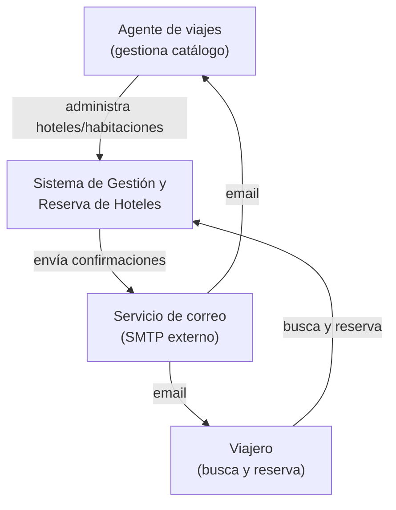
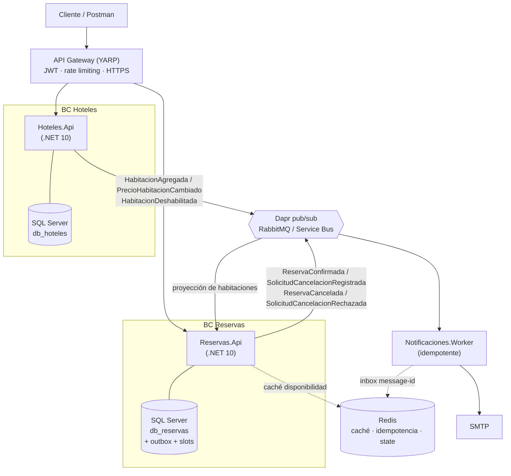

# Diagramas de arquitectura (C4 y flujos)

Compañero de [SPEC.md](SPEC.md). Todos los diagramas del contrato viven aquí.

## C4 Nivel 1 — Contexto



## C4 Nivel 2 — Contenedores



## Estilo arquitectónico

- **Microservicios por Bounded Context**, comunicación **asíncrona por eventos** (Event Driven; sin acoplamiento síncrono entre dominios).
- **Clean Architecture** dentro de cada servicio: `Domain ← Application ← Infrastructure ← API`. El dominio define **puertos** (interfaces de repositorio y mensajería); EF Core, Dapr, Redis y SMTP son sus **adaptadores** en infraestructura.
- **API Gateway (YARP)** como punto único de entrada: enrutamiento, autenticación JWT, rate limiting, HTTPS enforcement.

## Flujo crítico de reserva

1. `POST /api/v1/reservas` con `HabitacionId`, `Estancia`, huéspedes y contacto de emergencia.
2. Se valida (fechas coherentes `salida > entrada`, capacidad ≥ huéspedes, habitación activa en proyección).
3. Se calcula el precio: `(costoBase + impuesto) × noches`.
4. En **una sola transacción** (READ COMMITTED): se inserta `Reserva`, se insertan las `NocheHabitacion` de la estancia (el índice `UNIQUE` rechaza solapamientos → HTTP 409; ver ADR-016) **y** se escribe el evento en la tabla `outbox`.
5. El *relay* publica `ReservaConfirmada`.
6. `Notificaciones.Worker` consume (idempotente vía Redis) y envía los correos.

## Flujo de cancelación (discreción del agente)

**Vías de inicio** (mismo comando, distinto `Iniciador`; la autorización se resuelve en el borde):
- **Viajero:** `POST /api/v1/reservas/{id}/cancelaciones` sobre su propia reserva.
- **Agente** (viajero que contactó a la agencia): mismo endpoint bajo rol Agente, con `Iniciador = Agente`.

1. **Solicitud.** Se valida que la reserva sea `Confirmada`, con estancia futura y sin solicitud en curso. Se registra el `MotivoCancelacion` (categoría + texto libre) y se **congela** la `PenalidadSugerida` (ref = fecha de solicitud: ≥30 días → 0%, <30 días → 100%). La reserva pasa a `CancelacionSolicitada` y en la misma transacción se escribe `SolicitudCancelacionRegistrada` en el `outbox`.
2. El *relay* publica el evento; `Notificaciones.Worker` avisa al agente (por resolver) y envía al viajero un **acuse con la penalidad estimada** (no es el cobro final).
3. **Resolución (agente del hotel):** `PATCH /api/v1/reservas/{id}/cancelaciones/{cid}`. Tres desenlaces, cada uno en **una sola transacción** (guard de estado + `rowversion`; una segunda resolución concurrente → 409):
   - **Aprobar (aplicar o condonar):** registra `PenalidadDecidida` (con flag default/override y quién decidió); la reserva pasa a `Cancelada`, se **borran las `NocheHabitacion`** de la estancia (libera inventario) y se escribe `ReservaCancelada` en el `outbox` (payload con hotel, tipo y fechas liberadas).
   - **Rechazar:** la reserva vuelve a `Confirmada` con el motivo del rechazo, **sin tocar slots**, y se escribe `SolicitudCancelacionRechazada` en el `outbox`.
4. `Notificaciones.Worker` consume (idempotente) y notifica al viajero: penalidad final / condonación, o rechazo indicando que la reserva **sigue Confirmada**.

> **Atajo del agente:** cuando atiende al viajero por teléfono, el agente puede solicitar y resolver en una sola operación; se registran **ambos** eventos (solicitud y resolución) para no dejar decisiones huérfanas en la auditoría. Las solicitudes pendientes exponen su antigüedad ("días en espera"); no hay expiración automática.

## Slot de inventario (DDL anti-overbooking)

```sql
-- Una fila por (habitación, noche). La unicidad impide doble reserva de la misma noche.
CREATE TABLE NochesHabitacion (
    HabitacionId UNIQUEIDENTIFIER NOT NULL,
    Noche        DATE             NOT NULL,
    ReservaId    UNIQUEIDENTIFIER NOT NULL,
    CONSTRAINT PK_NochesHabitacion PRIMARY KEY (HabitacionId, Noche)  -- unicidad = anti-overbooking
);
```

## Evolución CQRS con read model en MongoDB (diseñada, NO implementada)

```
Comando (reservar) ─► SQL Server   (verdad transaccional, invariantes, anti-overbooking)
                          │ evento de dominio (Dapr pub/sub)
                          ▼
                     proyección ─► MongoDB (documentos desnormalizados, solo lectura)
                                       ▲
Query (buscar disponibilidad) ────────┘  (sin joins; un documento pre-armado)
```

- **Write** en SQL Server; **Read** en MongoDB (documentos desnormalizados, índices de texto/geoespaciales por ciudad, escala de lectura horizontal).
- **Consistencia eventual** entre ambos: la confirmación de reserva SIEMPRE va contra SQL con el constraint anti-overbooking; Mongo es una vista.
- Seguridad del read model (contiene PII): SCRAM-SHA-256, RBAC de permiso mínimo, TLS en tránsito, cifrado en reposo (WiredTiger), **CSFLE / Queryable Encryption** para documento y email del huésped, aislamiento de red, minimización de datos.
